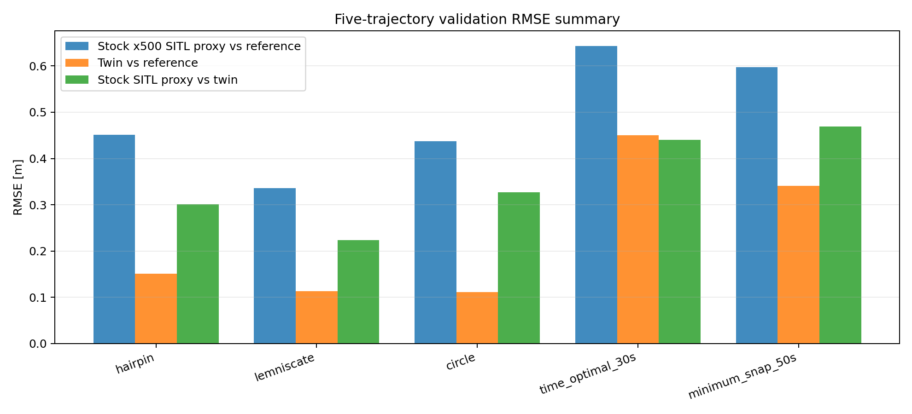
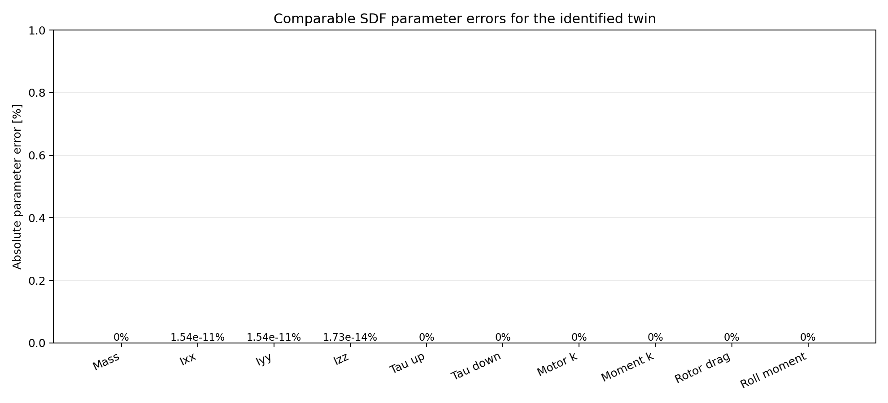
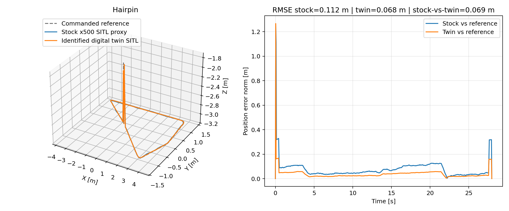
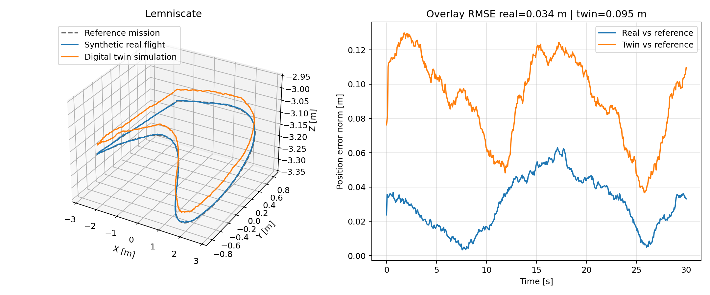
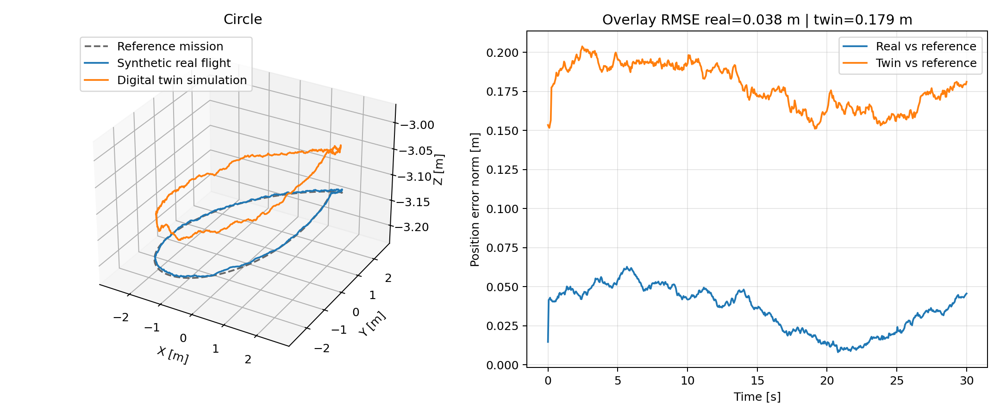
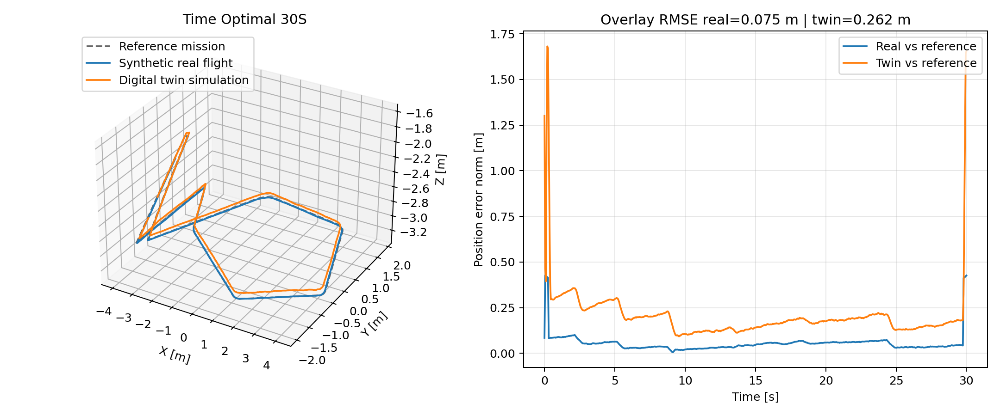
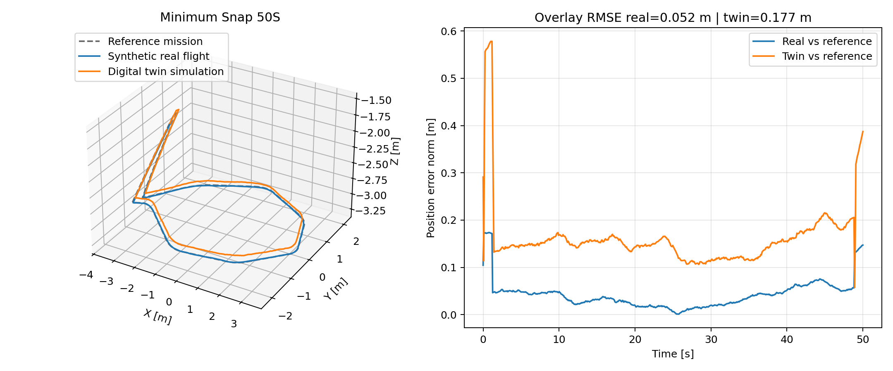

PX4 System Identification Workspace
==================================

This repository is for one workflow:
1. run system identification,
2. estimate an x500-compatible SDF candidate,
3. run five validation trajectories,
4. compare the digital twin with the reference traces.

Main folders
------------
- `overlay/`: PX4 and Gazebo additions
- `experimental_validation/`: estimation, comparison, figures
- `examples/`: short operator guides
- `system_identification.txt`: longer technical text for papers and reports

Fastest operator checklist:
- [operator_quickstart.md](/home/earsub/px4-system-identification/examples/operator_quickstart.md)

1. Create the dedicated PX4 workspace
------------------------------------
Use only this PX4 tree for this repository:
- `~/PX4-Autopilot-Identification`

```bash
cd ~
git clone https://github.com/PX4/PX4-Autopilot.git --recursive PX4-Autopilot-Identification
cd ~/PX4-Autopilot-Identification
bash ./Tools/setup/ubuntu.sh

cd ~
git clone git@github.com:erdemarslan380/px4-system-identification.git
cd ~/px4-system-identification
./sync_into_px4_workspace.sh ~/PX4-Autopilot-Identification
```

2. Build for CubeOrange hardware
--------------------------------
For CubeOrange, resync once with the CubeOrange board file enabled:

```bash
cd ~/px4-system-identification
./sync_into_px4_workspace.sh ~/PX4-Autopilot-Identification boards/cubepilot/cubeorange/default.px4board

cd ~/PX4-Autopilot-Identification
make cubepilot_cubeorange_default
```

Build output:
- `~/PX4-Autopilot-Identification/build/cubepilot_cubeorange_default/cubepilot_cubeorange_default.px4`

With the CubeOrange connected over USB, upload from the terminal with:

```bash
cd ~/px4-system-identification
python3 examples/upload_cubeorange_firmware.py
```

This helper targets `/dev/ttyACM0` directly and uses a smaller CubeOrange-safe bootloader write size.
If you use a different flight controller, change both the board file path and the `make <board>_default` / `make <board>_default upload` target together.

3. Prepare the SD card for HITL and real flights
------------------------------------------------
For hardware runs, the trajectory files must be present on the SD card under `/fs/microsd/trajectories/`.

With the SD card mounted on the workstation:

```bash
cd ~/px4-system-identification
./examples/prepare_sdcard_payload.sh /media/$USER/<sdcard_mount_name>
```

This creates these directories on the card:
- `trajectories/`
- `tracking_logs/`
- `identification_logs/`

and copies the five shipped trajectory binaries:
- `id_100.traj`
- `id_101.traj`
- `id_102.traj`
- `id_103.traj`
- `id_104.traj`

Once the SD card is back on the CubeOrange, hardware logs are written to:
- `/fs/microsd/tracking_logs/`
- `/fs/microsd/identification_logs/`

The current overlay closes and flushes each CSV at the end of every run, so you can execute multiple identification profiles or trajectory runs in one boot session without rebooting PX4 between them.

4. Build and open Gazebo SITL
-----------------------------
```bash
cd ~/PX4-Autopilot-Identification
unset HEADLESS
make px4_sitl gz_x500
```

If this dedicated tree was created before the latest sync script update and the build stops with a missing `LTEST_MODE` parameter in `local_position_estimator`, resync once and rebuild from a clean SITL build directory:

```bash
cd ~/px4-system-identification
./sync_into_px4_workspace.sh ~/PX4-Autopilot-Identification
rm -rf ~/PX4-Autopilot-Identification/build/px4_sitl_default

cd ~/PX4-Autopilot-Identification
unset HEADLESS
make px4_sitl gz_x500
```

If an older run is still open:
```bash
shutdown
pkill -f '/PX4-Autopilot-Identification/build/px4_sitl_default/bin/px4' || true
pkill -f 'gz sim' || true
rm -f /tmp/px4_lock-0 /tmp/px4-sock-0
cd ~/PX4-Autopilot-Identification
unset HEADLESS
make px4_sitl gz_x500
```

5. Install and check the five shipped validation trajectories
-------------------------------------------------------------
This repository now uses only the shipped binary trajectory set under:
- `~/px4-system-identification/assets/validation_trajectories/`

Install those exact files into the PX4 workspace with:

```bash
cd ~/px4-system-identification
python3 experimental_validation/validation_trajectories.py \
  --trajectories-dir ~/PX4-Autopilot-Identification/build/px4_sitl_default/rootfs/trajectories
```

Files installed:
- `~/PX4-Autopilot-Identification/build/px4_sitl_default/rootfs/trajectories/id_100.traj`
- `~/PX4-Autopilot-Identification/build/px4_sitl_default/rootfs/trajectories/id_101.traj`
- `~/PX4-Autopilot-Identification/build/px4_sitl_default/rootfs/trajectories/id_102.traj`
- `~/PX4-Autopilot-Identification/build/px4_sitl_default/rootfs/trajectories/id_103.traj`
- `~/PX4-Autopilot-Identification/build/px4_sitl_default/rootfs/trajectories/id_104.traj`
- `~/PX4-Autopilot-Identification/build/px4_sitl_default/rootfs/trajectories/validation_manifest.json`

Trajectory map:
- `100`: `hairpin`, `23 s`
- `101`: `lemniscate`, `19 s`
- `102`: `circle`, `15 s`
- `103`: `time_optimal_30s`, `11 s`
- `104`: `minimum_snap_50s`, `14 s`

The `.traj` binaries are used as-is. No new validation trajectories are generated by this repository.
All five trajectories start from the same anchored hover pose at `(0, 0, -3)` in local NED. They do not all end at the same point, so return to hover before launching the next one.

6. Run campaigns in SITL
------------------------
Built-in campaigns:
- `identification_only`: 9 identification maneuvers
- `trajectory_only`: 5 validation trajectories
- `full_stack`: 9 identification maneuvers, then 5 validation trajectories

Return-to-anchor legs are handled inside `trajectory_reader` and are not logged.

If you want to watch SITL in QGroundControl, open QGC only after Gazebo is already running. In SITL, QGC is optional and may stay open as a passive viewer. Do not arm, disarm, or change modes from QGC while a scripted campaign is running.

SITL operator order:
1. start Gazebo SITL,
2. optionally open QGroundControl only as a viewer,
3. run the campaign helper from a second terminal,
4. close QGroundControl fully before moving on to HIL.

In `pxh>`:
```bash
custom_pos_control start
trajectory_reader start
custom_pos_control set px4_default
custom_pos_control enable
param set COM_DISARM_PRFLT 60
trajectory_reader ref 0 0 -3 0
```

From a second terminal, one full campaign:
```bash
cd ~/px4-system-identification
python3 examples/run_mavlink_campaign.py \
  --endpoint udpin:127.0.0.1:14550 \
  --campaign full_stack \
  --prepare-hover \
  --heartbeat-warmup 5 \
  --arm-attempts 10 \
  --timeout 520
```

Verified behavior in Gazebo SITL:
- the script climbs to the common `0 0 -3` hover point,
- `trajectory_reader` starts the campaign from a second terminal,
- `hover_thrust` opened one tracking CSV and one identification CSV,
- `mass_vertical` opened one additional tracking CSV and one additional identification CSV,
- the return leg between them did not create extra CSV files.

The full-stack campaign order is:
1. `hover_thrust`
2. `mass_vertical`
3. `roll_sweep`
4. `pitch_sweep`
5. `yaw_sweep`
6. `drag_x`
7. `drag_y`
8. `drag_z`
9. `motor_step`
10. trajectory `100` hairpin
11. trajectory `101` lemniscate
12. trajectory `102` circle
13. trajectory `103` time_optimal_30s
14. trajectory `104` minimum_snap_50s

Logs appear in:
- `~/PX4-Autopilot-Identification/build/px4_sitl_default/rootfs/identification_logs/`
- `~/PX4-Autopilot-Identification/build/px4_sitl_default/rootfs/tracking_logs/`
- `~/PX4-Autopilot-Identification/build/px4_sitl_default/rootfs/sysid_truth_logs/`

For identification-only runs:
```bash
cd ~/px4-system-identification
python3 examples/run_mavlink_campaign.py \
  --endpoint udpin:127.0.0.1:14550 \
  --campaign identification_only \
  --prepare-hover \
  --heartbeat-warmup 5 \
  --arm-attempts 10 \
  --timeout 420
```

For trajectory-only runs:
```bash
cd ~/px4-system-identification
python3 examples/run_mavlink_campaign.py \
  --endpoint udpin:127.0.0.1:14550 \
  --campaign trajectory_only \
  --prepare-hover \
  --heartbeat-warmup 5 \
  --arm-attempts 10 \
  --timeout 220
```

For one identification maneuver:
```bash
cd ~/px4-system-identification
python3 examples/run_hitl_udp_sequence.py \
  --endpoint udpin:127.0.0.1:14550 \
  --kind ident \
  --name hover_thrust
```

For one trajectory:
```bash
cd ~/px4-system-identification
python3 examples/run_hitl_udp_sequence.py \
  --endpoint udpin:127.0.0.1:14550 \
  --kind trajectory \
  --traj-id 100
```

Build the candidate after the identification part finishes:
```bash
cd ~/px4-system-identification
python3 experimental_validation/build_latest_x500_candidate.py \
  --rootfs ~/PX4-Autopilot-Identification/build/px4_sitl_default/rootfs \
  --out-dir ~/px4-system-identification/experimental_validation/outputs/x500_candidate
```

7. RC-assisted workflow selection
---------------------------------
For operator-driven HIL or real-flight use, the modules can be driven from RC pots plus one trigger button:
- `CST_RC_SEL_EN = 1`
- `CST_RC_CTRL_CH = <controller_pot>`
- `TRJ_RC_MODE_EN = 1`
- `TRJ_RC_MODE_CH = <workflow_pot>`
- `TRJ_RC_SEL_EN = 1`
- `TRJ_RC_SEL_CH = <item_pot>`
- `TRJ_RC_MIN_ID = 100`
- `TRJ_RC_MAX_ID = 104`
- `TRJ_RC_START_EN = 1`
- `TRJ_RC_START_BTN = <H_button_index>`

Workflow pot slots:
- `0`: hold position
- `1`: one identification maneuver
- `2`: one trajectory
- `3`: `identification_only`
- `4`: `trajectory_only`
- `5`: `full_stack`

Item pot behavior:
- in workflow slot `1`, the item pot selects one of the `9` identification profiles
- in workflow slot `2`, the item pot selects one trajectory id in `TRJ_RC_MIN_ID..TRJ_RC_MAX_ID`, with the default shipped range `100..104`

Trigger button behavior:
- press `H` with workflow slot `0`: return to hold
- press `H` with workflow slot `1`: start the selected identification profile
- press `H` with workflow slot `2`: start the selected trajectory
- press `H` with workflow slot `3`, `4`, or `5`: start the selected built-in campaign

8. HIL/HITL on CubeOrange with jMAVSim
-------------------------------------
Use HIL only as a pre-flight smoke test:
- does one long campaign stay stable in one boot,
- do RAM and CPU stay healthy,
- does the SD card receive one CSV per maneuver and trajectory.

Keep the split simple:
- current USB CDC device, for example `/dev/ttyACM0` or `/dev/ttyACM1`: `jMAVSim`
- `QGroundControl`: UDP only after `jMAVSim` is already running
- optional FTDI telemetry: do not use it for routine operator control in this workflow

Before HIL, fully close the SITL QGroundControl window. If QGC still has the USB CDC device open, `start_jmavsim_hitl.sh` will stop with `Serial device ... is already open`.

HIL operator order:
1. finish SITL and close the SITL QGroundControl window completely,
2. connect CubeOrange over USB,
3. open QGroundControl once over USB only to set `SYS_AUTOSTART = 1001` and `SYS_HITL = 1`,
4. reboot the board and close QGroundControl fully,
5. start `jMAVSim` on the current USB CDC device,
6. only after `jMAVSim` is already running, optionally reopen QGroundControl in UDP-only mode as a passive viewer,
7. run the HIL campaign helper from a second terminal.

List the current live serial devices:
```bash
ls /dev/ttyACM* /dev/ttyUSB*
```

Use the current USB CDC device path from that list below as `<usb_cdc_device>`.

During upload, close jMAVSim and QGroundControl:
```bash
cd ~/px4-system-identification
python3 examples/upload_cubeorange_firmware.py
```

Build jMAVSim once:
```bash
cd ~/PX4-Autopilot-Identification/Tools/simulation/jmavsim/jMAVSim
ant create_run_jar copy_res
```

Set the HIL airframe once in QGroundControl with the board connected over USB and `jMAVSim` still closed:
- `SYS_AUTOSTART = 1001`
- `SYS_HITL = 1`

Reboot the board, then close QGroundControl fully before continuing.

Start `jMAVSim` on the current USB CDC device:
```bash
cd ~/px4-system-identification
./examples/start_jmavsim_hitl.sh ~/PX4-Autopilot-Identification <usb_cdc_device> 921600
```

On this workstation the most common case is still:
```bash
cd ~/px4-system-identification
./examples/start_jmavsim_hitl.sh ~/PX4-Autopilot-Identification /dev/ttyACM0 921600
```

Only after `jMAVSim` is up, open QGroundControl again in UDP-only mode if you want a live viewer. Do not let QGC auto-connect back to the USB serial port.

If you need a short USB MAVLink shell check before starting `jMAVSim`, use:
```bash
python3 ~/PX4-Autopilot-Identification/Tools/mavlink_shell.py /dev/ttyACM0 -b 57600
```

One full HIL campaign:
```bash
cd ~/px4-system-identification
python3 examples/run_mavlink_campaign.py \
  --endpoint udpin:127.0.0.1:14550 \
  --campaign full_stack \
  --prepare-hover \
  --allow-missing-local-position \
  --blind-hover-seconds 12 \
  --timeout 520
```

Identification-only HIL campaign:
```bash
cd ~/px4-system-identification
python3 examples/run_mavlink_campaign.py \
  --endpoint udpin:127.0.0.1:14550 \
  --campaign identification_only \
  --prepare-hover \
  --allow-missing-local-position \
  --blind-hover-seconds 12 \
  --timeout 420
```

Trajectory-only HIL campaign:
```bash
cd ~/px4-system-identification
python3 examples/run_mavlink_campaign.py \
  --endpoint udpin:127.0.0.1:14550 \
  --campaign trajectory_only \
  --prepare-hover \
  --allow-missing-local-position \
  --blind-hover-seconds 12 \
  --timeout 220
```

One identification maneuver in HIL:
```bash
cd ~/px4-system-identification
python3 examples/run_hitl_udp_sequence.py \
  --endpoint udpin:127.0.0.1:14550 \
  --kind ident \
  --name hover_thrust \
  --allow-missing-local-position \
  --blind-hover-seconds 12
```

One trajectory in HIL:
```bash
cd ~/px4-system-identification
python3 examples/run_hitl_udp_sequence.py \
  --endpoint udpin:127.0.0.1:14550 \
  --kind trajectory \
  --traj-id 100 \
  --allow-missing-local-position \
  --blind-hover-seconds 12
```

The underlying HIL selectors are:
- `TRJ_ACTIVE_ID = 100..104`
- `TRJ_IDENT_PROF = 0..8`
- `TRJ_MODE_CMD = 0 position, 1 trajectory, 2 identification`
- `TRJ_MODE_CMD = 0` returns to position hold
- `TRJ_MODE_CMD = 1` starts the selected trajectory
- `TRJ_MODE_CMD = 2` starts the selected identification profile
- `TRJ_CAMPAIGN = 1 identification_only, 2 full_stack, 3 trajectory_only`
- `TRJ_CAMPAIGN_STA = 0 idle, 1 active, 2 completed, 3 aborted`

After a successful full-stack HIL smoke run, the SD-card acceptance check is:
- `9` identification CSV files under `/fs/microsd/identification_logs/`
- `14` tracking CSV files under `/fs/microsd/tracking_logs/`

That is the only HIL acceptance target for this repository. The five validation trajectory figures are produced from SITL and later real-flight logs, not from HIL.

9. Refresh the figure package
-----------------------------
```bash
cd ~/px4-system-identification
./examples/refresh_demo_assets.sh ~/PX4-Autopilot-Identification
```

Main outputs:
- `~/px4-system-identification/examples/paper_assets/paper_validation_summary.json`
- `~/px4-system-identification/examples/paper_assets/figures/`

10. Off-Nominal SITL Check
--------------------------
This repository also ships a pre-HITL SITL methodology check that uses the five shipped trajectories exactly as provided:
- stock `x500` with baseline PX4 PID (`px4_default`),
- an off-nominal `x500_offnominal` with about `5%` mass and inertia reduction,
- slower motor dynamics and slightly altered motor coefficients,
- a light breeze world (`0.6 0.2 0.0 m/s`),
- the full nine identification maneuvers on the off-nominal model,
- re-identification against the perturbed SDF,
- a second five-trajectory pass in the windy off-nominal world.

Run it with:

```bash
cd ~/px4-system-identification
python3 experimental_validation/offnominal_sitl_study.py \
  --px4-root ~/PX4-Autopilot-Identification \
  --out-dir ~/px4-system-identification/examples/offnominal_sitl_study
```

Main outputs:
- `~/px4-system-identification/examples/offnominal_sitl_study/offnominal_study_summary.json`
- `~/px4-system-identification/examples/offnominal_sitl_study/candidate_offnominal_recovered/sdf_comparison.json`
- `~/px4-system-identification/examples/offnominal_sitl_study/figures/group_1_circle_hairpin_lemniscate.png`
- `~/px4-system-identification/examples/offnominal_sitl_study/figures/group_2_time_optimal_minimum_snap.png`

Current off-nominal identification result:
- recovered blended twin score: `100.00 / 100`
- recovered `mass`, `inertia`, `time constants`, `max rotor velocity`, and `motor constant` match the perturbed SDF in the current truth-assisted SITL check

Current trajectory RMSE summary:
- `circle`: stock `52.745 m`, off-nominal windy `55.425 m`
- `hairpin`: stock `109.208 m`, off-nominal windy `115.545 m`
- `lemniscate`: stock `84.210 m`, off-nominal windy `89.361 m`
- `time_optimal_30s`: stock `38.151 m`, off-nominal windy `39.947 m`
- `minimum_snap_50s`: stock `53.216 m`, off-nominal windy `55.833 m`

The requested legend naming is used in these figures:
- `Reference`
- `SITL`
- `Real flight results`

In this README section, `Real flight results` is only a label for the off-nominal windy SITL proxy so the visual style matches the planned real-flight comparison layout.

Three-trajectory panel:


Two-trajectory panel:


11. Real-flight use
-------------------
Before the first real-flight test on CubeOrange, build and flash the hardware firmware:

```bash
cd ~/px4-system-identification
./sync_into_px4_workspace.sh ~/PX4-Autopilot-Identification boards/cubepilot/cubeorange/default.px4board

cd ~/PX4-Autopilot-Identification
make cubepilot_cubeorange_default
```

Flash this file from QGroundControl:
- `~/PX4-Autopilot-Identification/build/cubepilot_cubeorange_default/cubepilot_cubeorange_default.px4`

Use the same campaign choices on hardware:
- `full_stack`
- `identification_only`
- `trajectory_only`
- one identification maneuver
- one trajectory

On the SD card, keep these folders:
- `/fs/microsd/trajectories/`
- `/fs/microsd/tracking_logs/`
- `/fs/microsd/identification_logs/`

On the vehicle shell:
```bash
custom_pos_control start
trajectory_reader start
custom_pos_control set px4_default
custom_pos_control enable
trajectory_reader ref 0 0 -3 0
```

One full flight campaign:
```bash
trajectory_reader set_campaign full_stack
trajectory_reader start_campaign
```

Identification-only flight campaign:
```bash
trajectory_reader set_campaign identification_only
trajectory_reader start_campaign
```

Trajectory-only flight campaign:
```bash
trajectory_reader set_campaign trajectory_only
trajectory_reader start_campaign
```

One identification maneuver:
```bash
custom_pos_control set sysid
trajectory_reader set_ident_profile hover_thrust
trajectory_reader set_mode identification
```

One trajectory:
```bash
custom_pos_control set px4_default
trajectory_reader set_traj_id 100
trajectory_reader set_mode trajectory
```

After the flight, copy the CSV files into this repository under a session directory, for example:
- `~/px4-system-identification/flight_runs/session_001/tracking_logs/`
- `~/px4-system-identification/flight_runs/session_001/identification_logs/`

The imported real-flight baseline PID traces already stored in this repository live under:
- `~/px4-system-identification/examples/real_flight_baseline_pid/tracking_logs/`

Current stock-SITL vs imported real-flight baseline figures are generated with:
```bash
cd ~/px4-system-identification
python3 experimental_validation/trajectory_comparison_figures.py \
  --stock-root ~/px4-system-identification/examples/offnominal_sitl_study/results/stock_baseline_pid \
  --compare-root ~/px4-system-identification/examples/real_flight_baseline_pid \
  --compare-label "Real flight baseline PID" \
  --out-dir ~/px4-system-identification/examples/real_flight_baseline_pid/figures
```

Those figures are stored here:
- `~/px4-system-identification/examples/real_flight_baseline_pid/figures/group_1_circle_hairpin_lemniscate.png`
- `~/px4-system-identification/examples/real_flight_baseline_pid/figures/group_2_time_optimal_minimum_snap.png`
- `~/px4-system-identification/examples/real_flight_baseline_pid/figures/comparison_summary.json`

The curves are aligned by each run's own reference start point so the shapes are directly comparable, while each contour error is still computed against that run's own reference CSV.


HIL-identified model comparison
-------------------------------
The intended HIL comparison block is:
1. run the 9 identification maneuvers in one HIL session and pull `identification_logs/*.csv`,
2. estimate a candidate from those HIL identification logs,
3. run the 5 validation trajectories in SITL with that candidate,
4. generate the same two grouped figures against the stock SITL baseline.

The command shape is the same:
```bash
cd ~/px4-system-identification
python3 experimental_validation/trajectory_comparison_figures.py \
  --stock-root ~/px4-system-identification/examples/offnominal_sitl_study/results/stock_baseline_pid \
  --compare-root ~/px4-system-identification/examples/hitl_identified_sitl \
  --compare-label "HIL-identified SITL" \
  --out-dir ~/px4-system-identification/examples/hitl_identified_sitl/figures
```

This repository currently does not contain HIL `identification_logs/*.csv` or HIL `tracking_logs/*.csv` under `hitl_runs/`, so there is no honest HIL-derived figure to embed yet. As soon as those CSVs exist, the figure generator above is the path that feeds the README section.

Phase A: identification
- build and flash your normal PX4 target with this overlay,
- take off manually to about `3 m`,
- switch to `OFFBOARD`,
- run the same nine `set_ident_profile ...` commands,
- copy the logs from:
  - `/fs/microsd/identification_logs/`
  - `/fs/microsd/tracking_logs/`

Phase B: trajectory validation
- keep `custom_pos_control` in `px4_default`,
- take off manually to about `3 m`,
- switch to `OFFBOARD`,
- move to the common start pose,
- run the same five trajectory IDs:
  - `100 hairpin`
  - `101 lemniscate`
  - `102 circle`
  - `103 time_optimal_30s`
  - `104 minimum_snap_50s`
- copy the resulting tracking CSV files from `/fs/microsd/tracking_logs/`

The real-flight command pattern is the same as SITL:
```bash
custom_pos_control start
trajectory_reader start
custom_pos_control set px4_default
custom_pos_control enable
trajectory_reader set_mode position
trajectory_reader abs_ref 0 0 -3 0
trajectory_reader set_traj_anchor 0 0 -3
trajectory_reader set_traj_id 100
trajectory_reader set_mode trajectory
```

A slightly longer sortie plan is here:
- [real_flight_sorties.md](/home/earsub/px4-system-identification/examples/real_flight_sorties.md)

12. Review SD-card logs in an interactive 3D browser UI
-------------------------------------------------------
After a HITL or real-flight session, copy the SD-card logs into the repository and build the review bundle:

```bash
cd ~/px4-system-identification
./examples/import_sdcard_logs.sh /media/$USER/<sdcard_mount_name> \
  ~/px4-system-identification/hitl_runs/session_001

python3 examples/pull_sdcard_logs_over_mavftp.py \
  --port <usb_cdc_device> \
  --baud 57600 \
  --destination-dir ~/px4-system-identification/hitl_runs/session_001

python3 experimental_validation/build_hitl_review_bundle.py \
  --log-root ~/px4-system-identification/hitl_runs/session_001 \
  --out-dir ~/px4-system-identification/hitl_runs/session_001/review
```

Use only one import path per session:
- mounted SD card: `import_sdcard_logs.sh`
- live USB CDC / MAVFTP pull: `pull_sdcard_logs_over_mavftp.py`

Before the live USB CDC pull:
- close `jMAVSim`,
- close `QGroundControl`,
- close any `mavlink_shell.py` session on the same USB CDC device,
- confirm the current USB CDC device with `ls /dev/ttyACM*`.

If you do not want to remove the SD card after flight, the intended path is:
1. keep the board connected over USB CDC,
2. close `jMAVSim`, `QGroundControl`, and any MAVLink shell,
3. run `pull_sdcard_logs_over_mavftp.py`,
4. build the review bundle.

If you want to browse the card first and then download selected files, start the MAVFTP browser:
```bash
cd ~/px4-system-identification
python3 examples/sdcard_browser.py \
  --serial-port <usb_cdc_device> \
  --baud 57600
```

Then open:
- `http://127.0.0.1:8765/`

The browser lists `/fs/microsd`, opens subdirectories, and pulls selected files into:
- `~/px4-system-identification/hitl_runs/browser_downloads/`

`pull_sdcard_logs_over_mavftp.py` now:
- enforces single-process access to `/dev/ttyACM0`,
- skips files that are already complete locally,
- retries missing files on the next run,
- writes a transfer summary to `pull_report.json`.

To pull `.ulg` files from the PX4 log folder instead of the custom CSV folders:
```bash
cd ~/px4-system-identification
python3 examples/pull_sdcard_logs_over_mavftp.py \
  --port /dev/ttyACM0 \
  --baud 57600 \
  --destination-dir ~/px4-system-identification/hitl_runs/session_001 \
  --remote-group ulog_2026_03_28=/fs/microsd/log/2026-03-28 \
  --suffix .ulg
```

Open:
- `~/px4-system-identification/hitl_runs/session_001/review/index.html`

The review page provides:
- a zoomable and pannable 3D path viewer,
- reference and vehicle overlays when both are present,
- X/Y/Z versus time plots,
- per-run duration, row count, and position RMSE,
- direct links to the copied raw CSV files.

To keep the inspection package in GitHub, commit both the imported CSV folders and the generated `review/` folder.

The repository also ships a demo review bundle generated from the current SITL tracking logs:
- [HITL Review Demo](/home/earsub/px4-system-identification/examples/hitl_review_demo/index.html)

13. Current shipped results and figures
---------------------------------------
Current summary:
- blended twin score: `100.00 / 100`
- Stage-1 RMSE:
  - `hairpin`: stock `0.451 m`, twin `0.150 m`
  - `lemniscate`: stock `0.336 m`, twin `0.113 m`
  - `circle`: stock `0.438 m`, twin `0.111 m`
  - `time_optimal_30s`: stock `0.644 m`, twin `0.450 m`
  - `minimum_snap_50s`: stock `0.597 m`, twin `0.341 m`

Summary figure:



Parameter summary:



Trajectory overlays:







More figures and the full summary JSON are in:
- `~/px4-system-identification/examples/paper_assets/`
