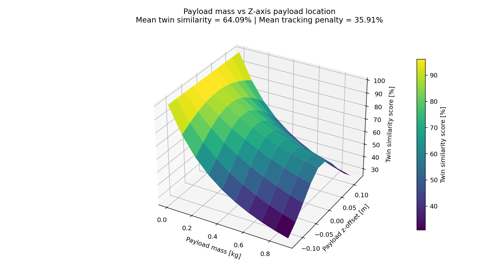

PX4 System Identification Workspace
==================================

This repository is a focused workspace for one job: identify a multicopter model from PX4 logs and build a Gazebo digital twin.

The workflow is intentionally split into two parts:
- `overlay/`
  PX4-side modules that generate the identification maneuvers and logs.
- `experimental_validation/`
  Offline estimation, SDF comparison, calibration restore, and paper-figure generation.

What this repository contains
- `overlay/`
  minimal PX4 source overlay for system identification
- `experimental_validation/`
  Python estimators and comparison tools
- `examples/`
  operator notes, example sorties, and paper assets
- `system_identification.txt`
  long-form method description for papers and reports
- `sync_into_px4_workspace.sh`
  copies the overlay into an upstream PX4 tree

What this repository does not contain
- the full PX4 source tree
- QGroundControl
- Gazebo itself
- the old optimization / planner / dashboard stack

That is intentional. The recommended workflow is:
1. clone upstream PX4
2. apply this overlay
3. build PX4 firmware
4. run identification sorties in Gazebo or on the real vehicle
5. estimate SDF parameters from the logs
6. regenerate figures and tables for the paper

Current status
- The truth-assisted SITL upper-bound is now effectively exact for the comparable x500 SDF terms.
- Current frozen upper-bound candidate:
  - `examples/paper_assets/candidates/x500_truth_assisted_sitl_v1/`
- Current comparable parameter errors are numerically zero or machine-precision close to zero for:
  - mass
  - `Ixx`, `Iyy`, `Izz`
  - `time_constant_up`, `time_constant_down`
  - `motor_constant`, `moment_constant`
  - `rotor_drag_coefficient`, `rolling_moment_coefficient`
  - `rotor_velocity_slowdown_sim`
- Current upper-bound blended twin score:
  - `99.99999999996612 / 100`

Important interpretation
- This near-perfect result is the simulator-side upper bound and uses Gazebo truth logs.
- That is the correct target for method development: if the method cannot recover the simulator's own hidden parameters under truth-assisted SITL, it is not ready for real-flight use.
- The synthetic trajectory overlays and stress-test surfaces in `examples/paper_assets/` are not claiming real-flight equivalence yet.
- They are placeholders for the paper layout and robustness visualization until real-flight logs are available.

Quick start on Ubuntu
1. Install PX4 prerequisites from the official PX4 Linux setup instructions:
   - https://docs.px4.io/main/en/dev_setup/dev_env_linux_ubuntu.html
2. Clone PX4 upstream:
```bash
cd ~
git clone https://github.com/PX4/PX4-Autopilot.git --recursive
```
3. Run the PX4 Ubuntu setup script inside the PX4 tree:
```bash
cd ~/PX4-Autopilot
bash ./Tools/setup/ubuntu.sh
```
4. Clone this repository:
```bash
cd ~
git clone git@github.com:erdemarslan380/px4-system-identification.git
```
5. Apply the overlay:
```bash
cd ~/px4-system-identification
./sync_into_px4_workspace.sh ~/PX4-Autopilot
```
6. Build Gazebo SITL with the x500 model:
```bash
cd ~/PX4-Autopilot
make px4_sitl gz_x500
```

Real-board note
- The sync script patches SITL by default.
- For hardware builds, pass your board file as the second argument. Example:
```bash
./sync_into_px4_workspace.sh ~/PX4-Autopilot boards/px4/fmu-v3/default.px4board
```
- The script ensures these module flags are enabled:
  - `CONFIG_MODULES_CUSTOM_POS_CONTROL=y`
  - `CONFIG_MODULES_TRAJECTORY_READER=y`

What the PX4 overlay adds
- `custom_pos_control`
  - minimal offboard forwarder
  - supports only `px4_default` and `sysid`
- `trajectory_reader`
  - position hold
  - prerecorded trajectory mode
  - built-in identification motions
- `SystemIdentificationLoggerPlugin`
  - logs Gazebo truth data during SITL

Watch the identification motion in Gazebo
1. Start SITL with GUI enabled:
```bash
cd ~/PX4-Autopilot
unset HEADLESS
make px4_sitl gz_x500
```
2. If PX4 started the Gazebo server but no window appeared, open the GUI in a second terminal:
```bash
gz sim -g
```
3. Keep Gazebo open while you run the PX4 shell commands below.

Small helper files
- visual launch helper:
  - `examples/start_visual_gz_x500.sh`
- copy-paste PX4 shell checklist:
  - `examples/visual_sitl_walkthrough.md`

Manual SITL identification workflow
1. Start PX4 SITL in Gazebo with the GUI visible.
2. In the PX4 shell, start the helper modules:
```bash
custom_pos_control start
trajectory_reader start
custom_pos_control enable
custom_pos_control set sysid
trajectory_reader set_mode identification
trajectory_reader set_ident_profile hover_thrust
```
3. Arm and take off using your normal safe bootstrap workflow.
4. Keep the vehicle near a stable hover reference.
5. Run one identification profile at a time:
```bash
trajectory_reader set_ident_profile hover_thrust
trajectory_reader set_ident_profile mass_vertical
trajectory_reader set_ident_profile roll_sweep
trajectory_reader set_ident_profile pitch_sweep
trajectory_reader set_ident_profile yaw_sweep
trajectory_reader set_ident_profile drag_x
trajectory_reader set_ident_profile drag_y
trajectory_reader set_ident_profile drag_z
trajectory_reader set_ident_profile motor_step
```
6. Logs are written under the PX4 rootfs:
- PX4 identification log:
  - `build/px4_sitl_default/rootfs/identification_logs/`
- PX4 tracking log:
  - `build/px4_sitl_default/rootfs/tracking_logs/`
- Gazebo truth log:
  - `build/px4_sitl_default/rootfs/sysid_truth_logs/`

Recommended sortie families
- `hover_thrust` + `mass_vertical`
  - mass and thrust scaling
- `roll_sweep` + `pitch_sweep` + `yaw_sweep`
  - principal inertia terms
- `drag_x` + `drag_y` + `drag_z`
  - aerodynamic drag terms
- `motor_step`
  - actuator dynamics and Gazebo motor-model terms

Estimate parameters from one flight log
```bash
cd ~/px4-system-identification
python3 experimental_validation/cli.py \
  --csv /path/to/identification_log.csv \
  --truth-csv /path/to/gazebo_truth_log.csv \
  --ident-log \
  --out-dir experimental_validation/outputs/session_001
```

Build a combined comparison against the x500 SDF
```bash
cd ~/px4-system-identification
python3 experimental_validation/compare_with_sdf.py \
  --csv /path/to/hover.csv \
  --csv /path/to/mass_vertical.csv \
  --csv /path/to/roll.csv \
  --csv /path/to/pitch.csv \
  --csv /path/to/yaw.csv \
  --csv /path/to/drag_x.csv \
  --csv /path/to/drag_y.csv \
  --csv /path/to/drag_z.csv \
  --csv /path/to/motor_step.csv \
  --out-dir experimental_validation/outputs/x500_candidate
```

Refresh paper assets from a completed SITL suite
```bash
cd ~/px4-system-identification
python3 experimental_validation/refresh_sitl_truth_artifacts.py \
  --results-root /path/to/completed_results_root \
  --candidate-name x500_truth_assisted_sitl_v1 \
  --out-dir examples/paper_assets
```

Restore calibration values after a firmware update
- Export all vehicle parameters from QGroundControl and place the file at:
  - `experimental_validation/qgc/current_vehicle.params`
- Then run:
```bash
cd ~/px4-system-identification
python3 experimental_validation/calibration_restore.py \
  --input experimental_validation/qgc/current_vehicle.params \
  --out-dir experimental_validation/qgc/restore
```

Generate the paper figures
```bash
cd ~/px4-system-identification
python3 experimental_validation/paper_artifacts.py \
  --candidate-json examples/paper_assets/candidates/x500_truth_assisted_sitl_v1/identified_parameters.json \
  --out-dir examples/paper_assets
```

This writes:
- five validation trajectory overlays
- five stress-test surfaces
- five stress-test slice plots
- parameter-error bar chart
- family-score bar chart
- trajectory-summary score chart
- CSV files and `paper_validation_summary.json`

What the current figures mean
- Stage 1 overlay figures:
  - currently use synthetic noisy stand-ins for real-flight logs
  - they show how the paper figures will look once real flights are available
- Stage 2 stress-test figures:
  - keep the identified twin fixed
  - perturb the reference plant across payload, center of mass, arm length, and motor mismatch
  - vertical axis is `Twin similarity score [%]`
  - these are robustness plots, not claims of real-flight equivalence
- Base-model fit figures:
  - show direct parameter agreement between the identified x500 candidate and the x500 SDF

Tests
```bash
cd ~/px4-system-identification
python3 -m unittest \
  experimental_validation.tests.test_estimators \
  experimental_validation.tests.test_identification_pipeline \
  experimental_validation.tests.test_sdf_compare \
  experimental_validation.tests.test_calibration_restore \
  experimental_validation.tests.test_composite_candidate \
  experimental_validation.tests.test_perfect_recovery_benchmark \
  experimental_validation.tests.test_paper_artifacts
```

Repository layout
- `overlay/`: PX4 source overlay
- `experimental_validation/`: identification and SDF estimation pipeline
- `examples/`: operator-facing examples and paper assets
- `system_identification.txt`: method description for reports and papers
- `architecture.md`: project layout summary for future contributors
- `skills.md`: project-role summary for future AI/code collaborators

Example figures



