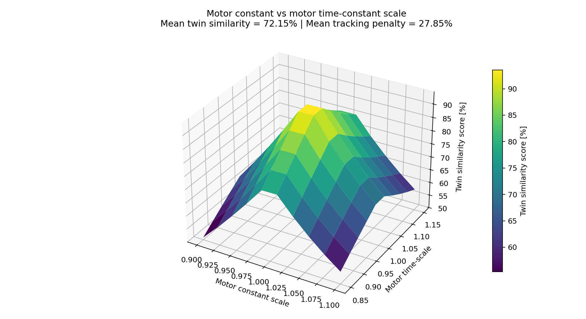
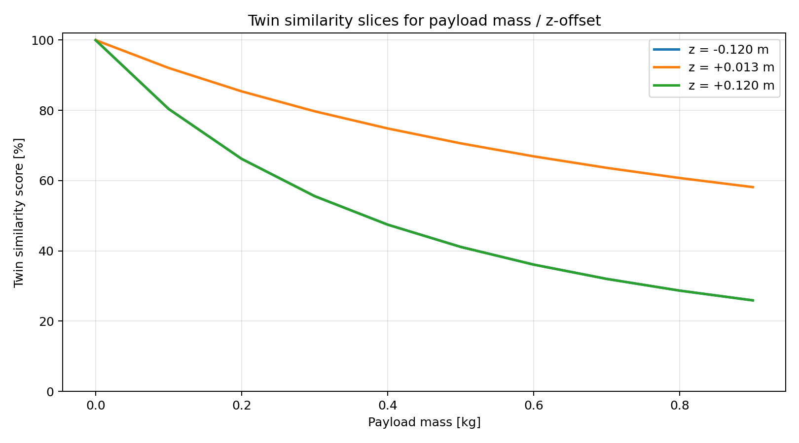

PX4 System Identification Workspace
==================================

This repository is a standalone workspace for one task: identify multicopter dynamics from PX4 logs and turn them into a Gazebo digital twin.

It is prepared for control researchers who want a direct workflow:
1. create one dedicated PX4 workspace,
2. build and run Gazebo SITL,
3. execute the identification maneuvers,
4. estimate the model and export an SDF candidate,
5. validate that model on five trajectories,
6. later replace the current Stage-1 proxy logs with real-flight logs and regenerate the same figures.

Repository layout
-----------------
- `overlay/`: PX4 and Gazebo code copied into the dedicated PX4 tree
- `experimental_validation/`: parameter estimation, comparison, figure generation
- `examples/`: operator walkthroughs, helper scripts, example YAML files
- `system_identification.txt`: long technical description for papers and reports

1. Create the dedicated PX4 workspace
------------------------------------

Use one PX4 tree only for this repository:
- `~/PX4-Autopilot-Identification`

Commands:
```bash
cd ~
git clone https://github.com/PX4/PX4-Autopilot.git --recursive PX4-Autopilot-Identification
cd ~/PX4-Autopilot-Identification
bash ./Tools/setup/ubuntu.sh

cd ~
git clone git@github.com:erdemarslan380/px4-system-identification.git
cd ~/px4-system-identification
./sync_into_px4_workspace.sh ~/PX4-Autopilot-Identification
```

2. Verify the repository state
------------------------------

Run the shipped smoke tests:
```bash
cd ~/px4-system-identification
./examples/run_repo_smoke_test.sh
```

Expected result:
- `Ran 15 tests ...`
- `OK`

3. Build and open Gazebo SITL
-----------------------------

```bash
cd ~/PX4-Autopilot-Identification
unset HEADLESS
make px4_sitl gz_x500
```

Healthy signs:
- `Generating uORB topic headers`
- `Linking CXX executable bin/px4`
- `INFO [init] Gazebo simulator ...`
- `INFO [init] Starting gazebo with world: ...`
- `pxh>`

If the command seems to reuse an older simulation, stop the old instance and start again:
```bash
# In pxh> if that shell is still open
shutdown

# In a normal terminal
pkill -f '/PX4-Autopilot-Identification/build/px4_sitl_default/bin/px4' || true
pkill -f '/PX4-Autopilot-Identification/.*/gz/worlds/' || true
rm -f /tmp/px4_lock-0 /tmp/px4-sock-0

cd ~/PX4-Autopilot-Identification
unset HEADLESS
make px4_sitl gz_x500
```

If the Gazebo GUI window does not appear:
```bash
gz sim -g
```

A shorter visual walkthrough is also available here:
- [visual_sitl_walkthrough.md](/home/earsub/px4-system-identification/examples/visual_sitl_walkthrough.md)

4. Run the identification maneuvers
-----------------------------------

In the PX4 shell:
```bash
custom_pos_control start
trajectory_reader start
custom_pos_control enable
custom_pos_control set sysid
trajectory_reader set_mode identification
trajectory_reader set_ident_profile hover_thrust
```

Then use QGroundControl:
1. arm,
2. take off manually to about `3 m`,
3. stabilize hover,
4. switch to `OFFBOARD`.

Run one profile at a time, and wait for the completion messages before sending the next one:
```bash
trajectory_reader set_ident_profile hover_thrust
trajectory_reader set_ident_profile mass_vertical
trajectory_reader set_ident_profile roll_sweep
trajectory_reader set_ident_profile pitch_sweep
trajectory_reader set_ident_profile yaw_sweep
trajectory_reader set_ident_profile drag_x
trajectory_reader set_ident_profile drag_y
trajectory_reader set_ident_profile drag_z
trajectory_reader set_ident_profile motor_step
```

Approximate durations:

| Profile | Purpose | Approx. duration |
| --- | --- | ---: |
| `hover_thrust` | hover-thrust tracking | `26 s` |
| `mass_vertical` | mass and thrust scale | `36 s` |
| `roll_sweep` | roll inertia and coupling | `28 s` |
| `pitch_sweep` | pitch inertia and coupling | `28 s` |
| `yaw_sweep` | yaw inertia and yaw moment balance | `24 s` |
| `drag_x` | X-axis drag | `30 s` |
| `drag_y` | Y-axis drag | `30 s` |
| `drag_z` | Z-axis drag | `30 s` |
| `motor_step` | motor time constants | `24 s` |

During execution PX4 prints:
- `Identification maneuver started: ...`
- `Purpose: ...`
- `Estimated duration: ...`
- `Identification maneuver completed: ...`
- `Identification log completed: ...`
- `Tracking log completed: ...`

Those final messages mean the current maneuver is finished and the vehicle is holding the final reference.

5. Where the logs and trajectories are written
----------------------------------------------

SITL log directories:
- `~/PX4-Autopilot-Identification/build/px4_sitl_default/rootfs/identification_logs/`
- `~/PX4-Autopilot-Identification/build/px4_sitl_default/rootfs/tracking_logs/`
- `~/PX4-Autopilot-Identification/build/px4_sitl_default/rootfs/sysid_truth_logs/`

Validation trajectory files:
- `~/PX4-Autopilot-Identification/build/px4_sitl_default/rootfs/trajectories/id_100.traj`
- `~/PX4-Autopilot-Identification/build/px4_sitl_default/rootfs/trajectories/id_101.traj`
- `~/PX4-Autopilot-Identification/build/px4_sitl_default/rootfs/trajectories/id_102.traj`
- `~/PX4-Autopilot-Identification/build/px4_sitl_default/rootfs/trajectories/id_103.traj`
- `~/PX4-Autopilot-Identification/build/px4_sitl_default/rootfs/trajectories/id_104.traj`
- `~/PX4-Autopilot-Identification/build/px4_sitl_default/rootfs/trajectories/validation_manifest.json`

Trajectory mapping:
- `id_100`: `hairpin`
- `id_101`: `lemniscate`
- `id_102`: `circle`
- `id_103`: `time_optimal_30s`
- `id_104`: `minimum_snap_50s`

6. Estimate the model and export the SDF candidate
--------------------------------------------------

If you rerun a profile, multiple CSV files with the same profile name are expected. Do not select them manually with long shell chains. Use the helper below. It always chooses the latest CSV for each required profile and reports missing families clearly.

Estimate from the latest maneuver log pair:
```bash
LATEST_IDENT=$(ls -1t ~/PX4-Autopilot-Identification/build/px4_sitl_default/rootfs/identification_logs/*.csv | head -n 1)
LATEST_TRUTH=$(ls -1t ~/PX4-Autopilot-Identification/build/px4_sitl_default/rootfs/sysid_truth_logs/*.csv | head -n 1)

cd ~/px4-system-identification
python3 experimental_validation/cli.py \
  --csv "$LATEST_IDENT" \
  --truth-csv "$LATEST_TRUTH" \
  --ident-log \
  --out-dir ~/px4-system-identification/experimental_validation/outputs/session_001
```

Main outputs:
- `~/px4-system-identification/experimental_validation/outputs/session_001/identified_parameters.json`
- `~/px4-system-identification/experimental_validation/outputs/session_001/candidate_inertial.sdf.xml`
- `~/px4-system-identification/experimental_validation/outputs/session_001/candidate_vehicle_params.yaml`

Recommended path for the full family:
```bash
cd ~/px4-system-identification
python3 experimental_validation/build_latest_x500_candidate.py \
  --rootfs ~/PX4-Autopilot-Identification/build/px4_sitl_default/rootfs \
  --out-dir ~/px4-system-identification/experimental_validation/outputs/x500_candidate
```

This helper script:
- selects the latest CSV for each required profile,
- uses the latest matching truth log under `sysid_truth_logs` when available,
- falls back honestly if truth data are not available,
- reports missing profiles instead of silently producing a partial candidate.

This is now the recommended operator path. The older manual `HOVER=$(ls -1t ...)` style selection is intentionally no longer the documented workflow.

7. Refresh the shipped figures
------------------------------

This repository already contains a complete shipped figure set. To refresh it on this machine:
```bash
cd ~/px4-system-identification
./examples/refresh_demo_assets.sh ~/PX4-Autopilot-Identification
```

This command:
- regenerates the five validation trajectories,
- rebuilds the current Stage-1 SITL comparison inputs,
- regenerates all shipped figures,
- updates the summary file.

Main outputs:
- `~/px4-system-identification/examples/paper_assets/paper_validation_summary.json`
- `~/px4-system-identification/examples/paper_assets/figures/`

8. Current shipped SITL results
-------------------------------

Current summary:
- base blended twin score: `100.00 / 100`
- Stage-1 stock proxy vs digital twin RMSE:
  - `hairpin`: stock `0.112 m`, twin `0.068 m`
  - `lemniscate`: stock `0.053 m`, twin `0.026 m`
  - `circle`: stock `0.068 m`, twin `0.031 m`
  - `time_optimal_30s`: stock `0.112 m`, twin `0.068 m`
  - `minimum_snap_50s`: stock `0.072 m`, twin `0.069 m`

Summary figure:


Parameter-fit summary:


Five trajectory overlays:


Example stress-test figure:



One example line-plot view:



9. Troubleshooting
------------------

If PX4 prints:
- `NodeShared::Publish() Error: Interrupted system call`
- `vehicle_imu ... gyro timestamp error`
- `vehicle_imu ... accel timestamp error`

right after a maneuver ends or while you restart the simulation, that usually means Gazebo transport was interrupted during shutdown or the session was restarted too quickly. It is not by itself proof that the identified model is wrong.

What to do:
1. stop the current SITL session cleanly with `shutdown`,
2. restart `make px4_sitl gz_x500`,
3. rerun only the affected profile,
4. then rebuild the candidate with `build_latest_x500_candidate.py`.

If `sysid_truth_logs/` is missing:
1. resync the overlay:
   - `cd ~/px4-system-identification`
   - `./sync_into_px4_workspace.sh ~/PX4-Autopilot-Identification`
2. rebuild:
   - `cd ~/PX4-Autopilot-Identification`
   - `unset HEADLESS`
   - `make px4_sitl gz_x500`

In the current repository version, manual x500 SITL writes Gazebo truth logs automatically to:
- `~/PX4-Autopilot-Identification/build/px4_sitl_default/rootfs/sysid_truth_logs/`

If the directory exists but stays empty after a completed maneuver, treat that as a plugin-loading problem, not as a valid identification result. The current sync script patches both:
- `Tools/simulation/gz/models/x500/model.sdf`
- `Tools/simulation/gz/simulation-gazebo`

so the normal recovery is:
1. `cd ~/px4-system-identification`
2. `./sync_into_px4_workspace.sh ~/PX4-Autopilot-Identification`
3. restart SITL
4. rerun the maneuver

Do not trust `truth_assisted` comparisons while `sysid_truth_logs/` is empty.

Complete shipped stress-test figure set:
- `examples/paper_assets/figures/payload_z_surface.png`
- `examples/paper_assets/figures/payload_x_offset_surface.png`
- `examples/paper_assets/figures/payload_y_offset_surface.png`
- `examples/paper_assets/figures/arm_length_surface.png`
- `examples/paper_assets/figures/motor_model_surface.png`
- `examples/paper_assets/figures/payload_z_lines.png`
- `examples/paper_assets/figures/payload_x_offset_lines.png`
- `examples/paper_assets/figures/payload_y_offset_lines.png`
- `examples/paper_assets/figures/arm_length_lines.png`
- `examples/paper_assets/figures/motor_model_lines.png`

9. Hardware build and real-flight plan
--------------------------------------

The real-flight sortie plan is documented here:
- [real_flight_sorties.md](/home/earsub/px4-system-identification/examples/real_flight_sorties.md)

The intended real-flight sequence is:
1. build and flash the overlay-enabled firmware to the flight controller,
2. run Sorties 1-4 for identification,
3. identify the model and write it into the Gazebo SDF candidate,
4. simulate the five validation trajectories,
5. fly the same five validation trajectories on the real vehicle,
6. replace the current Stage-1 blue-side proxy CSV files with the real-flight CSV files,
7. regenerate the same figures.

10. Replace the Stage-1 proxy logs later
----------------------------------------

Today the Stage-1 blue side is filled with `stock x500 SITL proxy` logs so the figure set is complete before real flights exist.

Later, replace these files:
- `~/px4-system-identification/examples/paper_assets/stage1_inputs/stock_sitl_proxy/tracking_logs/hairpin.csv`
- `~/px4-system-identification/examples/paper_assets/stage1_inputs/stock_sitl_proxy/tracking_logs/lemniscate.csv`
- `~/px4-system-identification/examples/paper_assets/stage1_inputs/stock_sitl_proxy/tracking_logs/circle.csv`
- `~/px4-system-identification/examples/paper_assets/stage1_inputs/stock_sitl_proxy/tracking_logs/time_optimal_30s.csv`
- `~/px4-system-identification/examples/paper_assets/stage1_inputs/stock_sitl_proxy/tracking_logs/minimum_snap_50s.csv`

Then regenerate the figures:
```bash
cd ~/px4-system-identification
python3 experimental_validation/sitl_validation_artifacts.py \
  --out-dir ~/px4-system-identification/examples/paper_assets \
  --stock-root ~/px4-system-identification/examples/paper_assets/stage1_inputs/stock_sitl_proxy \
  --twin-root ~/px4-system-identification/examples/paper_assets/stage1_inputs/digital_twin_sitl \
  --candidate-json ~/px4-system-identification/examples/paper_assets/candidates/x500_truth_assisted_sitl_v1/identified_parameters.json
```

11. Troubleshooting
-------------------

If you see a one-off warning such as:
- `NodeShared::Publish() Error: Interrupted system call`
- `vehicle_imu ... timestamp error`

and the current profile still prints:
- `Identification maneuver completed: ...`
- `Identification log completed: ...`
- `Tracking log completed: ...`

then the current log was still closed cleanly. Finish that profile, then restart SITL before continuing the next session.

If `sysid_truth_logs/` does not exist:
1. rerun:
   - `./sync_into_px4_workspace.sh ~/PX4-Autopilot-Identification`
2. rebuild:
   - `make px4_sitl gz_x500`
3. start a fresh SITL session

The current repository version injects `SystemIdentificationLoggerPlugin` into `x500/model.sdf` and writes truth CSVs automatically into:
- `~/PX4-Autopilot-Identification/build/px4_sitl_default/rootfs/sysid_truth_logs/`

12. Additional references
-------------------------
- [experimental_validation/README.md](/home/earsub/px4-system-identification/experimental_validation/README.md)
- [system_identification.txt](/home/earsub/px4-system-identification/system_identification.txt)
- [examples/visual_sitl_walkthrough.md](/home/earsub/px4-system-identification/examples/visual_sitl_walkthrough.md)
