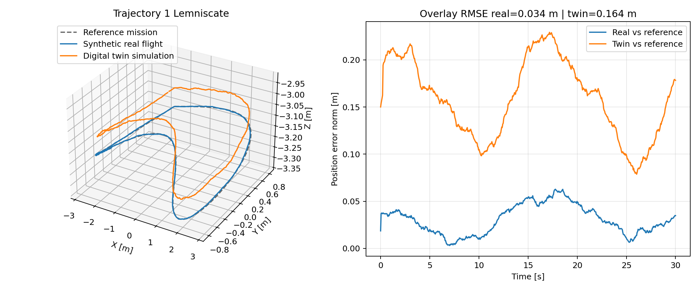

PX4 System Identification Workspace
==================================

This repository is a focused workspace for one job: identify a multicopter model from PX4 flight logs and build a Gazebo digital-twin candidate.

What this repository contains
- `overlay/`
  PX4-side source files that add the system-identification flight mode, the identification motion generator, and the Gazebo truth logger.
- `experimental_validation/`
  Python code that estimates mass, inertia, drag, and motor-model terms from exported logs.
- `examples/`
  Example sortie definitions and operator notes.
- `system_identification.txt`
  Long-form methodology notes for paper writing.
- `sync_into_px4_workspace.sh`
  Copies the overlay into an upstream PX4 workspace and patches the minimum build hooks.

What this repository does not contain
- the full PX4 source tree
- QGroundControl
- Gazebo itself

That is intentional. The recommended workflow is:
1. clone upstream PX4
2. apply this overlay
3. build PX4 firmware
4. run identification flights in Gazebo or on the real vehicle
5. estimate SDF parameters from the logs

Quick start on Ubuntu
1. Install PX4 prerequisites from the official PX4 Linux setup instructions:
   - https://docs.px4.io/main/en/dev_setup/dev_env_linux_ubuntu.html
2. Clone PX4 upstream:
```bash
cd ~
git clone https://github.com/PX4/PX4-Autopilot.git --recursive
```
3. Run the PX4 Ubuntu setup script inside the PX4 tree:
```bash
cd ~/PX4-Autopilot
bash ./Tools/setup/ubuntu.sh
```
4. Clone this repository:
```bash
cd ~
git clone git@github.com:erdemarslan380/px4-system-identification.git
```
5. Apply the overlay:
```bash
cd ~/px4-system-identification
./sync_into_px4_workspace.sh ~/PX4-Autopilot
```
6. Build Gazebo SITL with the x500 model:
```bash
cd ~/PX4-Autopilot
make px4_sitl gz_x500
```

Real-board note
- The sync script patches SITL by default.
- For hardware builds, pass your board file as the second argument. Example:
```bash
./sync_into_px4_workspace.sh ~/PX4-Autopilot boards/px4/fmu-v3/default.px4board
```
- The script ensures these module flags are enabled:
  - `CONFIG_MODULES_CUSTOM_POS_CONTROL=y`
  - `CONFIG_MODULES_TRAJECTORY_READER=y`

What the PX4 overlay adds
- `custom_pos_control`
  - minimal offboard forwarder
  - supports only `px4_default` and `sysid`
- `trajectory_reader`
  - position hold
  - prerecorded trajectory mode
  - built-in identification motions
- `SystemIdentificationLoggerPlugin`
  - logs Gazebo truth data during SITL

SITL system-identification workflow
1. Start PX4 SITL in Gazebo:
```bash
cd ~/PX4-Autopilot
make px4_sitl gz_x500
```
2. In the PX4 shell, start the helper modules:
```bash
custom_pos_control start
trajectory_reader start
custom_pos_control enable
custom_pos_control set sysid
trajectory_reader set_mode identification
trajectory_reader set_ident_profile hover_thrust
```
3. Arm and take off using your normal offboard/bootstrap workflow.
4. Keep the vehicle near a stable hover reference.
5. Run one identification profile at a time by changing the profile:
```bash
trajectory_reader set_ident_profile mass_vertical
trajectory_reader set_ident_profile roll_sweep
trajectory_reader set_ident_profile pitch_sweep
trajectory_reader set_ident_profile yaw_sweep
trajectory_reader set_ident_profile drag_x
trajectory_reader set_ident_profile drag_y
trajectory_reader set_ident_profile drag_z
trajectory_reader set_ident_profile motor_step
```
6. The PX4-side logs are written under the PX4 rootfs:
   - `build/px4_sitl_default/rootfs/identification_logs/`
   - `build/px4_sitl_default/rootfs/tracking_logs/`
7. In Gazebo SITL, truth logs are written under:
   - `build/px4_sitl_default/rootfs/sysid_truth_logs/`

Recommended identification families
- `mass_vertical` + `hover_thrust`
  - mass and thrust scaling
- `roll_sweep` + `pitch_sweep` + `yaw_sweep`
  - diagonal inertia terms
- `drag_x` + `drag_y` + `drag_z`
  - aerodynamic drag terms
- `motor_step`
  - motor time constants and motor-model terms

Important interpretation note
- The built-in Gazebo `x500` model is an `X` quad configuration, not a `+` configuration.
- In other words, the current remaining mismatch is not primarily explained by the frame geometry choice.
- The larger source of bias is that the practical SITL workflow is still a closed-loop OFFBOARD identification problem:
  - the maneuver excites the plant indirectly through the PX4 baseline PID,
  - some families are easier to isolate than others,
  - motor and inertia terms are therefore not equally observable from every sortie.
- To separate estimator quality from maneuver-quality, this repository now includes a synthetic noiseless upper-bound benchmark.

Estimate parameters from one flight log
```bash
cd ~/px4-system-identification
python3 experimental_validation/cli.py \
  --csv /path/to/identification_log.csv \
  --truth-csv /path/to/gazebo_truth_log.csv \
  --ident-log \
  --out-dir experimental_validation/outputs/session_001
```

Build a combined comparison against the x500 SDF
```bash
cd ~/px4-system-identification
python3 experimental_validation/compare_with_sdf.py \
  --csv /path/to/hover.csv \
  --csv /path/to/roll.csv \
  --csv /path/to/pitch.csv \
  --csv /path/to/yaw.csv \
  --csv /path/to/drag_x.csv \
  --csv /path/to/drag_y.csv \
  --csv /path/to/drag_z.csv \
  --csv /path/to/motor_step.csv \
  --out-dir experimental_validation/outputs/x500_candidate
```

Restore calibration values after a firmware update
- Export all vehicle parameters from QGroundControl and place the file at:
  - `experimental_validation/qgc/current_vehicle.params`
- Then run:
```bash
cd ~/px4-system-identification
python3 experimental_validation/calibration_restore.py \
  --input experimental_validation/qgc/current_vehicle.params \
  --out-dir experimental_validation/qgc/restore
```

Tests
```bash
cd ~/px4-system-identification
python3 -m unittest \
  experimental_validation.tests.test_estimators \
  experimental_validation.tests.test_identification_pipeline \
  experimental_validation.tests.test_sdf_compare \
  experimental_validation.tests.test_calibration_restore \
  experimental_validation.tests.test_composite_candidate \
  experimental_validation.tests.test_perfect_recovery_benchmark
```

Repository layout
- `overlay/`: PX4 source overlay
- `experimental_validation/`: identification and SDF estimation pipeline
- `examples/`: operator-facing examples
- `system_identification.txt`: method description for reports and papers


Paper validation assets
- Generate the current paper-style figures and summary with:
```bash
cd ~/px4-system-identification
python3 experimental_validation/paper_artifacts.py \
  --out-dir examples/paper_assets
```
- This writes:
  - three synthetic placeholder real-flight overlay figures
  - five statistical stress-test surface figures
  - CSV files and `paper_validation_summary.json`

Upper-bound benchmark
- To verify that the estimator itself can recover the SDF parameters when the data are perfectly informative, run:
```bash
cd ~/px4-system-identification
python3 experimental_validation/perfect_recovery_benchmark.py \
  --out examples/paper_assets/perfect_recovery_benchmark.json
```
- The expected result is a near-perfect match to the x500 SDF reference.
- This benchmark is useful when explaining why practical closed-loop SITL identification can still have small residual errors even without sensor noise.

Example figures




