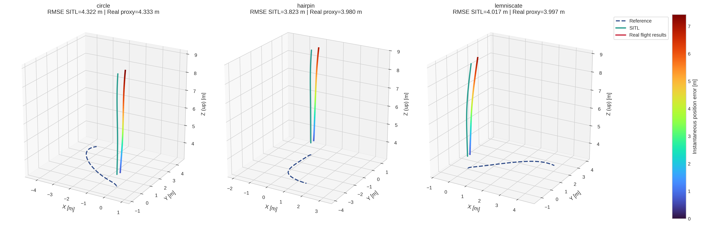
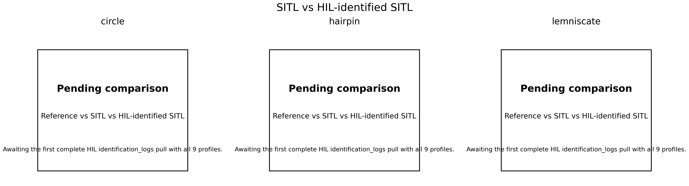
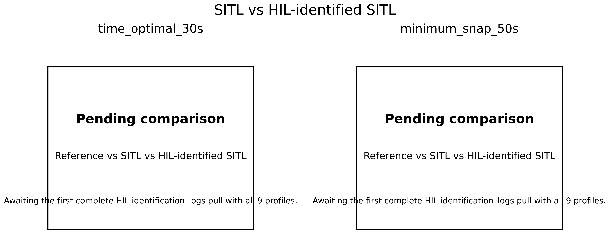
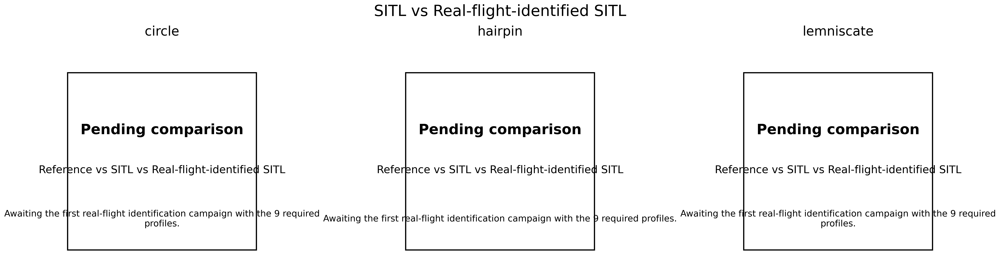
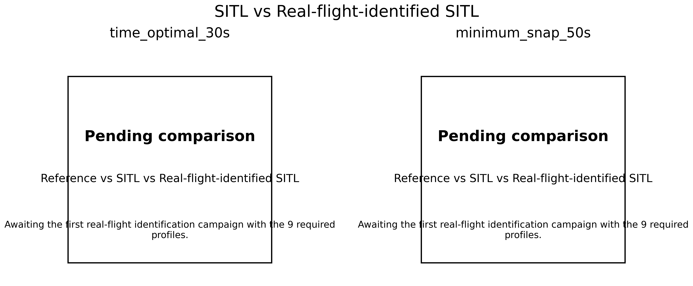

PX4 System Identification Workspace
==================================

This repository is for one workflow:
1. run system identification,
2. estimate an x500-compatible SDF candidate,
3. run five validation trajectories,
4. compare the digital twin with the reference traces.

Short path:
- [operator_quickstart.md](/home/earsub/px4-system-identification/examples/operator_quickstart.md)

Long technical reference:
- [system_identification.txt](/home/earsub/px4-system-identification/system_identification.txt)

Use this order
--------------
1. Prepare the PX4 workspace.
2. Run the full workflow in `SITL`.
3. If `SITL` is clean, run the `HIL` smoke test.
4. If `HIL` is clean, collect `real-flight` logs.
5. Build the identified model and regenerate the comparison figures.

Programs used in this workflow
------------------------------
- `Terminal`: all build, run, and log-processing commands
- `Gazebo`: `SITL`
- `QGroundControl`: parameter setup, optional viewer, parameter export
- hardware simulator: `HIL` only

1. Create the dedicated PX4 workspace
------------------------------------
Use only this PX4 tree with this repository:
- `~/PX4-Autopilot-Identification`

```bash
cd ~
git clone https://github.com/PX4/PX4-Autopilot.git --recursive PX4-Autopilot-Identification
cd ~/PX4-Autopilot-Identification
bash ./Tools/setup/ubuntu.sh

cd ~
git clone git@github.com:erdemarslan380/px4-system-identification.git
cd ~/px4-system-identification
./sync_into_px4_workspace.sh ~/PX4-Autopilot-Identification
```

2. Build for CubeOrange hardware
--------------------------------
Sync once with the CubeOrange board file, then build:

```bash
cd ~/px4-system-identification
./sync_into_px4_workspace.sh ~/PX4-Autopilot-Identification boards/cubepilot/cubeorange/default.px4board

cd ~/PX4-Autopilot-Identification
make cubepilot_cubeorange_default
```

Expected firmware:
- `~/PX4-Autopilot-Identification/build/cubepilot_cubeorange_default/cubepilot_cubeorange_default.px4`

Upload with:

```bash
cd ~/px4-system-identification
python3 examples/upload_cubeorange_firmware.py
```

If you use a different flight controller, change both the board file path and the `make <board>_default` / `make <board>_default upload` target together.

3. Prepare the SD card for HITL and real flights
------------------------------------------------
The SD card must contain `/fs/microsd/trajectories`, `/fs/microsd/tracking_logs`, and `/fs/microsd/identification_logs`.

With the SD card mounted on the workstation:

```bash
cd ~/px4-system-identification
./examples/prepare_sdcard_payload.sh /media/$USER/<sdcard_mount_name>
```

This copies these shipped files:
- `id_100.traj`
- `id_101.traj`
- `id_102.traj`
- `id_103.traj`
- `id_104.traj`

4. Build and open Gazebo SITL
-----------------------------
Open a new terminal and keep it open.

```bash
cd ~/PX4-Autopilot-Identification
unset HEADLESS
make px4_sitl gz_x500
```

Expected result:
- Gazebo opens
- PX4 finishes boot
- the same terminal shows `pxh>`

If Gazebo does not open:

```bash
cd ~/px4-system-identification
./sync_into_px4_workspace.sh ~/PX4-Autopilot-Identification
rm -rf ~/PX4-Autopilot-Identification/build/px4_sitl_default

cd ~/PX4-Autopilot-Identification
unset HEADLESS
make px4_sitl gz_x500
```

If an older SITL run is still open:

```bash
shutdown
pkill -f '/PX4-Autopilot-Identification/build/px4_sitl_default/bin/px4' || true
pkill -f 'gz sim' || true
rm -f /tmp/px4_lock-0 /tmp/px4-sock-0
cd ~/PX4-Autopilot-Identification
unset HEADLESS
make px4_sitl gz_x500
```

5. Install the five shipped validation trajectories
---------------------------------------------------
Install the fixed binary set into the SITL rootfs:

```bash
cd ~/px4-system-identification
python3 experimental_validation/validation_trajectories.py   --trajectories-dir ~/PX4-Autopilot-Identification/build/px4_sitl_default/rootfs/trajectories
```

Installed files:
- `id_100.traj`: `hairpin`, `23 s`
- `id_101.traj`: `lemniscate`, `19 s`
- `id_102.traj`: `circle`, `15 s`
- `id_103.traj`: `time_optimal_30s`, `11 s`
- `id_104.traj`: `minimum_snap_50s`, `14 s`

All five start from `(0, 0, -3)`. They do not all end at the same point.

6. Run campaigns in SITL
------------------------
Available campaigns:
- `identification_only`: 9 identification maneuvers
- `trajectory_only`: 5 validation trajectories
- `full_stack`: 9 identification maneuvers, then 5 validation trajectories

Optional viewer rule:
- `QGroundControl` may stay open in SITL as a passive viewer
- do not arm, disarm, or change modes from QGroundControl during a scripted campaign
- close QGroundControl fully before moving to HIL

In `pxh>`:

```bash
custom_pos_control start
trajectory_reader start
custom_pos_control set px4_default
custom_pos_control enable
param set COM_DISARM_PRFLT 60
trajectory_reader ref 0 0 -3 0
```

Run one full campaign from a second terminal:

```bash
cd ~/px4-system-identification
python3 examples/run_mavlink_campaign.py   --endpoint udpin:127.0.0.1:14550   --campaign full_stack   --prepare-hover   --heartbeat-warmup 5   --arm-attempts 10   --timeout 520
```

Other common runs:

```bash
cd ~/px4-system-identification
python3 examples/run_mavlink_campaign.py   --endpoint udpin:127.0.0.1:14550   --campaign identification_only   --prepare-hover   --heartbeat-warmup 5   --arm-attempts 10   --timeout 420
```

```bash
cd ~/px4-system-identification
python3 examples/run_mavlink_campaign.py   --endpoint udpin:127.0.0.1:14550   --campaign trajectory_only   --prepare-hover   --heartbeat-warmup 5   --arm-attempts 10   --timeout 220
```

One identification maneuver:

```bash
cd ~/px4-system-identification
python3 examples/run_hitl_udp_sequence.py   --endpoint udpin:127.0.0.1:14550   --kind ident   --name hover_thrust
```

One trajectory:

```bash
cd ~/px4-system-identification
python3 examples/run_hitl_udp_sequence.py   --endpoint udpin:127.0.0.1:14550   --kind trajectory   --traj-id 100
```

Expected SITL outputs:
- `~/PX4-Autopilot-Identification/build/px4_sitl_default/rootfs/identification_logs/`
- `~/PX4-Autopilot-Identification/build/px4_sitl_default/rootfs/tracking_logs/`
- `~/PX4-Autopilot-Identification/build/px4_sitl_default/rootfs/sysid_truth_logs/`

Build the candidate after the identification part finishes:

```bash
cd ~/px4-system-identification
python3 experimental_validation/build_latest_x500_candidate.py   --rootfs ~/PX4-Autopilot-Identification/build/px4_sitl_default/rootfs   --out-dir ~/px4-system-identification/experimental_validation/outputs/x500_candidate
```

7. RC-assisted workflow selection
---------------------------------
Use RC only after normal radio calibration is complete.

Required parameters:
- `CST_RC_SEL_EN = 1`
- `CST_RC_CTRL_CH = <controller_pot>`
- `TRJ_RC_MODE_EN = 1`
- `TRJ_RC_MODE_CH = <workflow_pot>`
- `TRJ_RC_SEL_EN = 1`
- `TRJ_RC_SEL_CH = <item_pot>`
- `TRJ_RC_MIN_ID = 100`
- `TRJ_RC_MAX_ID = 104`
- `TRJ_RC_START_EN = 1`
- `TRJ_RC_START_CH = <H_switch_aux>`
- `TRJ_RC_START_BTN = <H_button_index>`

workflow pot slots:
- `0`: hold position
- `1`: one identification maneuver
- `2`: one trajectory
- `3`: `identification_only`
- `4`: `trajectory_only`
- `5`: `full_stack`

Item pot:
- workflow `1`: select one of the 9 identification profiles
- workflow `2`: select one trajectory id in `100..104`

Trigger button:
- press `H` in slot `0`: return to hold
- press `H` in slot `1`: start the selected identification profile
- press `H` in slot `2`: start the selected trajectory
- press `H` in slot `3`, `4`, or `5`: start the selected campaign
- trigger accepted: positive tune
- cancel or invalid trigger: negative tune
- pot movement alone: no tune

Controller pot:
- one end selects `PX4 default`
- the other end selects `SYSID`

QGroundControl mapping:
- in `Vehicle Setup > Radio`, finish normal calibration first
- note which spare controls move `AUX 1..6`
- `CST_RC_CTRL_CH`, `TRJ_RC_MODE_CH`, and `TRJ_RC_SEL_CH` use those `AUX 1..6` slots and map to `manual_control_setpoint.aux1..aux6`
- if the `H` switch behaves like a normal AUX channel, use that `auxN` slot for `TRJ_RC_START_CH`
- use `TRJ_RC_START_BTN` only if the trigger really appears in `manual_control_setpoint.buttons`
- verify the final mapping on the vehicle with `listener manual_control_setpoint`

Keep these paths separate:
- `Vehicle Setup > Flight Modes`: normal PX4 mode switch such as `Position` and `Offboard`
- RC pots plus `H`: this repository's maneuver, trajectory, and campaign selection

If the `H` switch does not change `manual_control_setpoint.buttons`, that is fine. Set `TRJ_RC_START_CH` to the matching `auxN` slot instead.

Fast RC bench check before any HIL campaign:
1. Connect the board over USB and open `QGroundControl`.
2. In `Vehicle Setup > Radio`, move the controller pot, workflow pot, item pot, and `H` button one by one.
3. Write down which spare controls appear as `AUX 1..6`, then close `QGroundControl` fully.
4. Open an NSH shell:
   ```bash
   python3 ~/PX4-Autopilot-Identification/Tools/mavlink_shell.py <usb_cdc_device> -b 57600
   ```
5. Start the modules:
   ```bash
   custom_pos_control start
   trajectory_reader start
   custom_pos_control enable
   ```
6. In NSH, watch the receiver mapping:
   ```bash
   listener manual_control_setpoint 20
   ```
7. Move only the controller pot and confirm the expected `auxN` changes.
8. Move only the workflow pot and confirm the expected `auxN` changes.
9. Move only the item pot and confirm the expected `auxN` changes.
10. Press `H` and confirm either `buttons` changes or one `auxN` jumps high.
11. Check the selected repo-side state:
   ```bash
   param show CST_POS_CTRL_TYP
   param show TRJ_MODE_CMD
   param show TRJ_CAMPAIGN
   param show TRJ_IDENT_PROF
   param show TRJ_ACTIVE_ID
   param show TRJ_RC_START_CH
   ```
12. Check the normal PX4 mode switch separately:
   ```bash
   listener vehicle_status 10
   ```
   Flip `Position -> Offboard -> Position` from the transmitter and verify the nav state changes.

8. HIL/HITL on CubeOrange with jMAVSim
-------------------------------------
Use HIL only as a smoke test:
- one uninterrupted campaign in one boot
- RAM and CPU remain healthy
- one CSV per maneuver or trajectory is written to the SD card

Keep the transport split simple:
- USB CDC device, for example `/dev/ttyACM0`: `jMAVSim`
- `QGroundControl`: UDP only after `jMAVSim` is already running

Warmup rule:
- after `jMAVSim` starts, do not arm immediately
- the helpers now wait for real `ATTITUDE` and stable `LOCAL_POSITION_NED` before arming
- use `--allow-missing-local-position` only as a temporary debug fallback, not as the normal HIL path
- in local NED, `z = -3` means about `3 m above` the home origin, not `3 m into the ground`
- the current HIL fix keeps boot-time position mode at a safe `z = 0` hold and only commands the `-3 m` hover target after `OFFBOARD` is already accepted

Recommended HIL order right now:
1. RC bench check from Section 7.
2. One HIL identification run.
3. One HIL trajectory run.
4. Only if both create CSV logs cleanly, try `identification_only` or `full_stack`.

Order:
1. finish SITL and close the SITL `QGroundControl` window
2. connect CubeOrange over USB
3. open `QGroundControl` once over USB and set `SYS_AUTOSTART = 1001` and `SYS_HITL = 1`
4. reboot the board and close `QGroundControl` fully
5. start `jMAVSim` on the current USB CDC device
6. optionally reopen `QGroundControl` in UDP-only mode
7. run the HIL helper from a second terminal

Find the current device:

```bash
ls /dev/ttyACM* /dev/ttyUSB*
```

Upload firmware only while `jMAVSim` and `QGroundControl` are closed:

```bash
cd ~/px4-system-identification
python3 examples/upload_cubeorange_firmware.py
```

Build `jMAVSim` once:

```bash
cd ~/PX4-Autopilot-Identification/Tools/simulation/jmavsim/jMAVSim
ant create_run_jar copy_res
```

Start `jMAVSim`:

```bash
cd ~/px4-system-identification
./examples/start_jmavsim_hitl.sh ~/PX4-Autopilot-Identification <usb_cdc_device> 921600
```

This starts the normal visible GUI. Use headless mode only when you explicitly want it:

```bash
cd ~/px4-system-identification
PX4_SYSID_HEADLESS=1 ./examples/start_jmavsim_hitl.sh ~/PX4-Autopilot-Identification <usb_cdc_device> 921600
```

Common case:

```bash
cd ~/px4-system-identification
./examples/start_jmavsim_hitl.sh ~/PX4-Autopilot-Identification /dev/ttyACM0 921600
```

Short USB MAVLink shell check before starting `jMAVSim`:

```bash
python3 ~/PX4-Autopilot-Identification/Tools/mavlink_shell.py /dev/ttyACM0 -b 57600
```

Full HIL campaign:

```bash
cd ~/px4-system-identification
python3 examples/run_mavlink_campaign.py   --endpoint udpin:127.0.0.1:14550   --campaign full_stack   --prepare-hover   --manual-control-mode 4   --sim-ready-timeout 25   --sim-ready-min-local-samples 3   --timeout 520
```

Keep the receiver active during HIL by changing only one flag:

```bash
cd ~/px4-system-identification
python3 examples/run_mavlink_campaign.py   --endpoint udpin:127.0.0.1:14550   --campaign full_stack   --prepare-hover   --manual-control-mode 0   --sim-ready-timeout 25   --sim-ready-min-local-samples 3   --timeout 520
```

Other HIL runs:

```bash
cd ~/px4-system-identification
python3 examples/run_mavlink_campaign.py   --endpoint udpin:127.0.0.1:14550   --campaign identification_only   --prepare-hover   --sim-ready-timeout 25   --sim-ready-min-local-samples 3   --timeout 420
```

```bash
cd ~/px4-system-identification
python3 examples/run_mavlink_campaign.py   --endpoint udpin:127.0.0.1:14550   --campaign trajectory_only   --prepare-hover   --sim-ready-timeout 25   --sim-ready-min-local-samples 3   --timeout 220
```

```bash
cd ~/px4-system-identification
python3 examples/run_hitl_udp_sequence.py   --endpoint udpin:127.0.0.1:14550   --kind ident   --name hover_thrust   --sim-ready-timeout 25   --sim-ready-min-local-samples 3
```

```bash
cd ~/px4-system-identification
python3 examples/run_hitl_udp_sequence.py   --endpoint udpin:127.0.0.1:14550   --kind trajectory   --traj-id 100   --sim-ready-timeout 25   --sim-ready-min-local-samples 3
```

If the helper times out before the run starts, do not force the campaign with blind hover first. Check the estimator path. A healthy HIL boot should provide:
- `ATTITUDE`
- `LOCAL_POSITION_NED`
- no repeated `Accel/Gyro/Baro missing` preflight spam

Minimal RC smoke test in HIL:

```bash
custom_pos_control start
trajectory_reader start
custom_pos_control set px4_default
custom_pos_control enable
```

The HIL airframe now boots `trajectory_reader` in safe position mode with a zero-altitude absolute hold target. For manual RC smoke tests, let the helper or RC trigger command the later `-3 m` hover target instead of pushing it at boot time.

Then arm in `Position`, switch `Position -> Offboard -> Position`, and only start a campaign after that check passes.

Important selectors:
- `TRJ_ACTIVE_ID = 100..104`
- `TRJ_IDENT_PROF = 0..8`
- `TRJ_MODE_CMD = 0 position, 1 trajectory, 2 identification`
- `TRJ_MODE_CMD = 1` starts the selected trajectory
- `TRJ_MODE_CMD = 2` starts the selected identification profile
- `TRJ_CAMPAIGN = 1 identification_only, 2 full_stack, 3 trajectory_only`
- `TRJ_CAMPAIGN_STA = 0 idle, 1 active, 2 completed, 3 aborted`

HIL acceptance target after `full_stack`:
- `9` files in `/fs/microsd/identification_logs/`
- `14` files in `/fs/microsd/tracking_logs/`

9. Refresh the figure package
-----------------------------
```bash
cd ~/px4-system-identification
./examples/refresh_demo_assets.sh ~/PX4-Autopilot-Identification
```

Main outputs:
- `~/px4-system-identification/examples/paper_assets/paper_validation_summary.json`
- `~/px4-system-identification/examples/paper_assets/figures/`

10. Off-Nominal SITL Check
--------------------------
This repository also ships a pre-HITL SITL methodology check that uses the five shipped trajectories exactly as provided:
- stock `x500` with baseline PX4 PID (`px4_default`),
- an off-nominal `x500_offnominal` with about `5%` mass and inertia reduction,
- slower motor dynamics and slightly altered motor coefficients,
- a light breeze world (`0.6 0.2 0.0 m/s`),
- the full nine identification maneuvers on the off-nominal model,
- re-identification against the perturbed SDF,
- a second five-trajectory pass in the windy off-nominal world.

Run it with:

```bash
cd ~/px4-system-identification
python3 experimental_validation/offnominal_sitl_study.py \
  --px4-root ~/PX4-Autopilot-Identification \
  --out-dir ~/px4-system-identification/examples/offnominal_sitl_study
```

Main outputs:
- `~/px4-system-identification/examples/offnominal_sitl_study/offnominal_study_summary.json`
- `~/px4-system-identification/examples/offnominal_sitl_study/candidate_offnominal_recovered/sdf_comparison.json`
- `~/px4-system-identification/examples/offnominal_sitl_study/figures/group_1_circle_hairpin_lemniscate.png`
- `~/px4-system-identification/examples/offnominal_sitl_study/figures/group_2_time_optimal_minimum_snap.png`

Current off-nominal identification result:
- recovered blended twin score: `100.00 / 100`
- recovered `mass`, `inertia`, `time constants`, `max rotor velocity`, and `motor constant` match the perturbed SDF in the current truth-assisted SITL check

Current trajectory RMSE summary:
- `circle`: stock `52.745 m`, off-nominal windy `55.425 m`
- `hairpin`: stock `109.208 m`, off-nominal windy `115.545 m`
- `lemniscate`: stock `84.210 m`, off-nominal windy `89.361 m`
- `time_optimal_30s`: stock `38.151 m`, off-nominal windy `39.947 m`
- `minimum_snap_50s`: stock `53.216 m`, off-nominal windy `55.833 m`

The requested legend naming is used in these figures:
- `Reference`
- `SITL`
- `Real flight results`

In this README section, `Real flight results` is only a label for the off-nominal windy SITL proxy so the visual style matches the planned real-flight comparison layout.

Three-trajectory panel:



Two-trajectory panel:


11. HIL and real-flight use
---------------------------
### 11.1 HIL smoke-test workflow
For HIL, the goal is not to revalidate all science in a second simulator. The goal is to prove that one uninterrupted campaign:
- runs on the real board,
- does not blow up RAM or CPU,
- writes the campaign CSV files to the SD card,
- and can be copied back over USB CDC.

Before the first HIL or real-flight test on CubeOrange, build and flash the hardware firmware:

```bash
cd ~/px4-system-identification
./sync_into_px4_workspace.sh ~/PX4-Autopilot-Identification boards/cubepilot/cubeorange/default.px4board

cd ~/PX4-Autopilot-Identification
make cubepilot_cubeorange_default
```

Flash this file from QGroundControl:
- `~/PX4-Autopilot-Identification/build/cubepilot_cubeorange_default/cubepilot_cubeorange_default.px4`

Minimal HIL order:
1. connect the board over USB,
2. open QGroundControl once over USB and set `SYS_AUTOSTART = 1001` and `SYS_HITL = 1`,
3. reboot the board and close QGroundControl fully,
4. start `jMAVSim` on the current USB CDC device,
5. reopen QGroundControl only in UDP-only mode if you want a viewer,
6. run `full_stack`, `identification_only`, `trajectory_only`, or one item.

Start `jMAVSim`:
```bash
cd ~/px4-system-identification
./examples/start_jmavsim_hitl.sh ~/PX4-Autopilot-Identification <usb_cdc_device> 921600
```

One HIL full campaign:
```bash
cd ~/px4-system-identification
python3 examples/run_mavlink_campaign.py \
  --endpoint udpin:127.0.0.1:14550 \
  --campaign full_stack \
  --prepare-hover \
  --allow-missing-local-position \
  --blind-hover-seconds 12 \
  --timeout 520
```

Use the same campaign choices on hardware:
- `full_stack`
- `identification_only`
- `trajectory_only`
- one identification maneuver
- one trajectory

The short command set for those variants is kept in:
- [operator_quickstart.md](/home/earsub/px4-system-identification/examples/operator_quickstart.md)

Verified HIL resource reporting:
1. finish the HIL run,
2. close `jMAVSim`, QGroundControl, and any MAVLink shell on the same USB CDC device,
3. pull the newest ULog from `/fs/microsd/log/...`,
4. summarize board RAM/CPU from that ULog.

Example pull and report commands:
```bash
cd ~/px4-system-identification
python3 examples/pull_sdcard_logs_over_mavftp.py \
  --port <usb_cdc_device> \
  --baud 57600 \
  --destination-dir ~/px4-system-identification/hitl_runs/session_001

python3 experimental_validation/report_hil_resources.py \
  --ulg ~/px4-system-identification/hitl_runs/session_001/ulg/<latest>.ulg \
  --out ~/px4-system-identification/hitl_runs/session_001/hil_resource_summary.json
```

Current checked HIL resource report for this repo:
- JSON: [live_check_001_summary.json](/home/earsub/px4-system-identification/examples/hil_resource_report/live_check_001_summary.json)
- board source logs:
  - [05_54_37.ulg](/home/earsub/px4-system-identification/hitl_runs/live_check_001_ulog/ulg/05_54_37.ulg)
  - [05_59_44.ulg](/home/earsub/px4-system-identification/hitl_runs/live_check_001_ulog/ulg/05_59_44.ulg)

Current measured HIL resource snapshots:

| Run | Source | Board CPU load | Board RAM usage | Result |
| --- | --- | --- | --- | --- |
| HIL live check A | `05_54_37.ulg` | `27.6%` single logged sample | `28.3%` single logged sample | clean but too short to sign off alone |
| HIL live check B | `05_59_44.ulg` | `16.5% min`, `17.1% mean`, `36.1% max` | first valid sample `24.9%`, then invalid spikes to `96657.7%` | failed |

Current host-side simulator snapshot during the same HIL window:

| Process | CPU | Memory | RSS |
| --- | --- | --- | --- |
| `jmavsim_run.jar` | `29.3%` | `5.1%` | `827228 KiB` |

Current HIL acceptance verdict:
- not signed off yet,
- the healthy snapshot proves the board can boot and start logging,
- the failed snapshot proves this HIL path still has a real issue:
  - `RAM usage too high: 96657.7%`
  - `wq:nav_and_controllers low on stack! (0 bytes left)`
  - `parameters verify: failed (-1)`
- keep using the same reporting command above after every HIL session until the verdict is clean.

### 11.2 HIL-identified SITL comparison
This block is reserved for the pipeline:
1. run the 9 identification maneuvers in one HIL session,
2. pull `identification_logs/*.csv`,
3. estimate an x500 candidate from those HIL logs,
4. run the 5 validation trajectories in SITL with that candidate,
5. compare that SITL result against the stock SITL baseline and the imported real-flight baseline traces.

Current status:
- the latest live USB CDC pull is:
  - [pull_report.json](/home/earsub/px4-system-identification/hitl_runs/live_probe/pull_report.json)
- that pull reached the card successfully,
- but `/fs/microsd/identification_logs/` still had no CSV files,
- so this block cannot be filled honestly yet.

Current pending figures for that block:





Fill this block only after a complete HIL identification session exists under:
- `~/px4-system-identification/hitl_runs/session_001/identification_logs/`

run:
```bash
cd ~/px4-system-identification
python3 experimental_validation/build_x500_candidate_from_logs.py \
  --ident-root ~/px4-system-identification/hitl_runs/session_001/identification_logs \
  --out-dir ~/px4-system-identification/experimental_validation/outputs/hitl_candidate

python3 experimental_validation/prepare_identified_model.py \
  --px4-root ~/PX4-Autopilot-Identification \
  --candidate-dir ~/px4-system-identification/experimental_validation/outputs/hitl_candidate \
  --model-name x500_hil_identified

python3 experimental_validation/run_sitl_validation.py \
  --px4-root ~/PX4-Autopilot-Identification \
  --candidate-dir ~/px4-system-identification/experimental_validation/outputs/hitl_candidate \
  --out-root ~/px4-system-identification/examples/hitl_identified_sitl/runs

python3 experimental_validation/trajectory_comparison_figures.py \
  --stock-root ~/px4-system-identification/examples/offnominal_sitl_study/results/stock_baseline_pid \
  --compare-root ~/px4-system-identification/examples/hitl_identified_sitl/runs/digital_twin \
  --compare-root-2 ~/px4-system-identification/examples/real_flight_baseline_pid \
  --compare-label "HIL-identified SITL" \
  --compare-label-2 "Real flight results" \
  --out-dir ~/px4-system-identification/examples/hitl_identified_sitl/figures
```

These HIL figures are intentionally kept inline in the README so the comparison is visible in the same document once the first honest HIL log pull exists.

### 11.3 Real-flight operation
Firmware updates without recalibrating everything:
- keep one full vehicle snapshot in:
  - `~/px4-system-identification/experimental_validation/qgc/current_vehicle.params`
- derive the build-time restore subset from it:
  - `~/px4-system-identification/experimental_validation/qgc/restore/`
- the build-embedded restore file is:
  - `~/px4-system-identification/overlay/ROMFS/px4fmu_common/init.d/rc.board_defaults`

Why this repo does not embed the full parameter dump directly:
- a full dump includes many temporary or environment-specific settings,
- embedding all of them into firmware would make HIL, logging, and experiment settings too rigid,
- so this workflow stores the full snapshot for reference but only bakes the calibration- and RC-related subset into `rc.board_defaults`.

Recommended primary path: use QGroundControl
1. connect the board,
2. open QGroundControl,
3. go to `Parameters`,
4. open `Tools`,
5. use `Save to file`,
6. save over:
   - `~/px4-system-identification/experimental_validation/qgc/current_vehicle.params`
7. regenerate the restore files:
```bash
cd ~/px4-system-identification
python3 experimental_validation/calibration_restore.py \
  --input ~/px4-system-identification/experimental_validation/qgc/current_vehicle.params \
  --out-dir ~/px4-system-identification/experimental_validation/qgc/restore \
  --board-defaults ~/px4-system-identification/overlay/ROMFS/px4fmu_common/init.d/rc.board_defaults
```

Fallback path if the vehicle is already reachable over MAVLink and you want one command:
```bash
cd ~/px4-system-identification
./examples/update_vehicle_calibration_snapshot.sh udpin:127.0.0.1:14550 57600
```

That helper:
- exports the full PX4 parameter snapshot,
- regenerates `restore_calibration.params` for QGroundControl import,
- regenerates `restore_calibration.nsh` for shell restore,
- regenerates `rc.board_defaults` so the next firmware build already carries the latest calibration-like defaults.

Then sync and rebuild as usual:
```bash
cd ~/px4-system-identification
./sync_into_px4_workspace.sh ~/PX4-Autopilot-Identification boards/cubepilot/cubeorange/default.px4board

cd ~/PX4-Autopilot-Identification
make cubepilot_cubeorange_default
```

Only redo the physical QGroundControl accelerometer / gyro / radio calibration if something on the real airframe changed:
- sensor mounting,
- controller orientation,
- receiver mapping,
- frame wiring,
- or a real hardware replacement.

On the SD card, keep these folders:
- `/fs/microsd/trajectories/`
- `/fs/microsd/tracking_logs/`
- `/fs/microsd/identification_logs/`

On the vehicle shell:
```bash
custom_pos_control start
trajectory_reader start
custom_pos_control set px4_default
custom_pos_control enable
trajectory_reader ref 0 0 -3 0
```

One full flight campaign:
```bash
trajectory_reader set_campaign full_stack
trajectory_reader start_campaign
```

Identification-only flight campaign:
```bash
trajectory_reader set_campaign identification_only
trajectory_reader start_campaign
```

Trajectory-only flight campaign:
```bash
trajectory_reader set_campaign trajectory_only
trajectory_reader start_campaign
```

One identification maneuver:
```bash
custom_pos_control set sysid
trajectory_reader set_ident_profile hover_thrust
trajectory_reader set_mode identification
```

One trajectory:
```bash
custom_pos_control set px4_default
trajectory_reader set_traj_id 100
trajectory_reader set_mode trajectory
```

After the flight, copy the CSV files into this repository under a session directory, for example:
- `~/px4-system-identification/flight_runs/session_001/tracking_logs/`
- `~/px4-system-identification/flight_runs/session_001/identification_logs/`

A slightly longer sortie plan is here:
- [real_flight_sorties.md](/home/earsub/px4-system-identification/examples/real_flight_sorties.md)

### 11.4 Real-flight-identified SITL comparison
This block is reserved for the final pipeline:
1. fly the 9 identification maneuvers on the real vehicle,
2. estimate an x500 candidate from the real-flight identification CSVs,
3. run the 5 validation trajectories in SITL with that candidate,
4. compare that SITL result against the stock SITL baseline and the imported real-flight baseline traces.

Current README placeholders for that future block:





When the first complete real-flight identification session exists under:
- `~/px4-system-identification/flight_runs/session_001/identification_logs/`

run:
```bash
cd ~/px4-system-identification
python3 experimental_validation/build_x500_candidate_from_logs.py \
  --ident-root ~/px4-system-identification/flight_runs/session_001/identification_logs \
  --out-dir ~/px4-system-identification/experimental_validation/outputs/real_flight_candidate

python3 experimental_validation/prepare_identified_model.py \
  --px4-root ~/PX4-Autopilot-Identification \
  --candidate-dir ~/px4-system-identification/experimental_validation/outputs/real_flight_candidate \
  --model-name x500_real_flight_identified

python3 experimental_validation/run_sitl_validation.py \
  --px4-root ~/PX4-Autopilot-Identification \
  --candidate-dir ~/px4-system-identification/experimental_validation/outputs/real_flight_candidate \
  --out-root ~/px4-system-identification/examples/real_flight_identified_sitl/runs

python3 experimental_validation/trajectory_comparison_figures.py \
  --stock-root ~/px4-system-identification/examples/offnominal_sitl_study/results/stock_baseline_pid \
  --compare-root ~/px4-system-identification/examples/real_flight_identified_sitl/runs/digital_twin \
  --compare-root-2 ~/px4-system-identification/examples/real_flight_baseline_pid \
  --compare-label "Real-flight-identified SITL" \
  --compare-label-2 "Real flight results" \
  --out-dir ~/px4-system-identification/examples/real_flight_identified_sitl/figures
```

### 11.5 Current imported real-flight baseline PID comparison
The imported real-flight baseline PID traces already stored in this repository live under:
- `~/px4-system-identification/examples/real_flight_baseline_pid/tracking_logs/`

Current README figures for this block use the same four-layer format as the intended HIL and future real-flight-identified blocks:
- `Reference`
- `Stock x500 SITL`
- `Identified/Tuned SITL`
- `Real flight results`

They are generated with:
```bash
cd ~/px4-system-identification
python3 experimental_validation/trajectory_comparison_figures.py \
  --stock-root ~/px4-system-identification/examples/offnominal_sitl_study/results/stock_baseline_pid \
  --compare-root ~/px4-system-identification/examples/paper_assets/stage1_inputs/digital_twin_sitl \
  --compare-root-2 ~/px4-system-identification/examples/real_flight_baseline_pid \
  --compare-label "Identified/Tuned SITL" \
  --compare-label-2 "Real flight results" \
  --out-dir ~/px4-system-identification/examples/real_flight_baseline_pid/figures
```

Those figures are stored here:
- `~/px4-system-identification/examples/real_flight_baseline_pid/figures/group_1_circle_hairpin_lemniscate.png`
- `~/px4-system-identification/examples/real_flight_baseline_pid/figures/group_2_time_optimal_minimum_snap.png`
- `~/px4-system-identification/examples/real_flight_baseline_pid/figures/comparison_summary.json`

Plotting rules for this block:
- the curves are aligned by each run's own reference start point,
- each contour error is still computed against that run's own reference CSV,
- each run is trimmed to the official trajectory duration,
- extra hold or return-to-anchor legs are not drawn.

Current imported file mapping:
- `circle <- t3r6_15891fec.csv`
- `hairpin <- t4r5_13e6b622.csv`
- `lemniscate <- t5r3_111ced1a.csv`
- `time_optimal_30s <- t103r1_c7ba798.csv`
- `minimum_snap_50s <- t104r2_e4f13fa.csv`


12. Review SD-card logs in an interactive 3D browser UI
-------------------------------------------------------
After a HITL or real-flight session, copy the SD-card logs into the repository and build the review bundle:

```bash
cd ~/px4-system-identification
./examples/import_sdcard_logs.sh /media/$USER/<sdcard_mount_name> \
  ~/px4-system-identification/hitl_runs/session_001

python3 examples/pull_sdcard_logs_over_mavftp.py \
  --port <usb_cdc_device> \
  --baud 57600 \
  --destination-dir ~/px4-system-identification/hitl_runs/session_001

python3 experimental_validation/build_hitl_review_bundle.py \
  --log-root ~/px4-system-identification/hitl_runs/session_001 \
  --out-dir ~/px4-system-identification/hitl_runs/session_001/review
```

Use only one import path per session:
- mounted SD card: `import_sdcard_logs.sh`
- live USB CDC / MAVFTP pull: `pull_sdcard_logs_over_mavftp.py`

Before the live USB CDC pull:
- close `jMAVSim`,
- close `QGroundControl`,
- close any `mavlink_shell.py` session on the same USB CDC device,
- confirm the current USB CDC device with `ls /dev/ttyACM*`.

If you do not want to remove the SD card after flight, the intended path is:
1. keep the board connected over USB CDC,
2. close `jMAVSim`, `QGroundControl`, and any MAVLink shell,
3. run `pull_sdcard_logs_over_mavftp.py`,
4. build the review bundle.

If you want to browse the card first and then download selected files, start the MAVFTP browser:
```bash
cd ~/px4-system-identification
python3 examples/sdcard_browser.py \
  --serial-port <usb_cdc_device> \
  --baud 57600
```

Then open:
- `http://127.0.0.1:8765/`

The browser lists `/fs/microsd`, opens subdirectories, and pulls selected files into:
- `~/px4-system-identification/hitl_runs/browser_downloads/`

`pull_sdcard_logs_over_mavftp.py` now:
- enforces single-process access to `/dev/ttyACM0`,
- skips files that are already complete locally,
- retries missing files on the next run,
- writes a transfer summary to `pull_report.json`.

To pull `.ulg` files from the PX4 log folder instead of the custom CSV folders:
```bash
cd ~/px4-system-identification
python3 examples/pull_sdcard_logs_over_mavftp.py \
  --port /dev/ttyACM0 \
  --baud 57600 \
  --destination-dir ~/px4-system-identification/hitl_runs/session_001 \
  --remote-group ulog_2026_03_28=/fs/microsd/log/2026-03-28 \
  --suffix .ulg
```

Open:
- `~/px4-system-identification/hitl_runs/session_001/review/index.html`

The review page provides:
- a zoomable and pannable 3D path viewer,
- reference and vehicle overlays when both are present,
- X/Y/Z versus time plots,
- per-run duration, row count, and position RMSE,
- direct links to the copied raw CSV files.

To keep the inspection package in GitHub, commit both the imported CSV folders and the generated `review/` folder.

The repository also ships a demo review bundle generated from the current SITL tracking logs:
- [HITL Review Demo](/home/earsub/px4-system-identification/examples/hitl_review_demo/index.html)

13. Current shipped results and figures
---------------------------------------
Current summary:
- blended twin score: `100.00 / 100`
- Stage-1 RMSE:
  - `hairpin`: stock `0.451 m`, twin `0.150 m`
  - `lemniscate`: stock `0.336 m`, twin `0.113 m`
  - `circle`: stock `0.438 m`, twin `0.111 m`
  - `time_optimal_30s`: stock `0.644 m`, twin `0.450 m`
  - `minimum_snap_50s`: stock `0.597 m`, twin `0.341 m`
